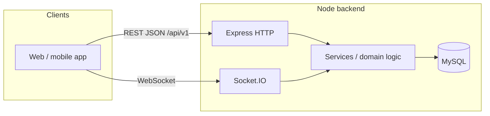
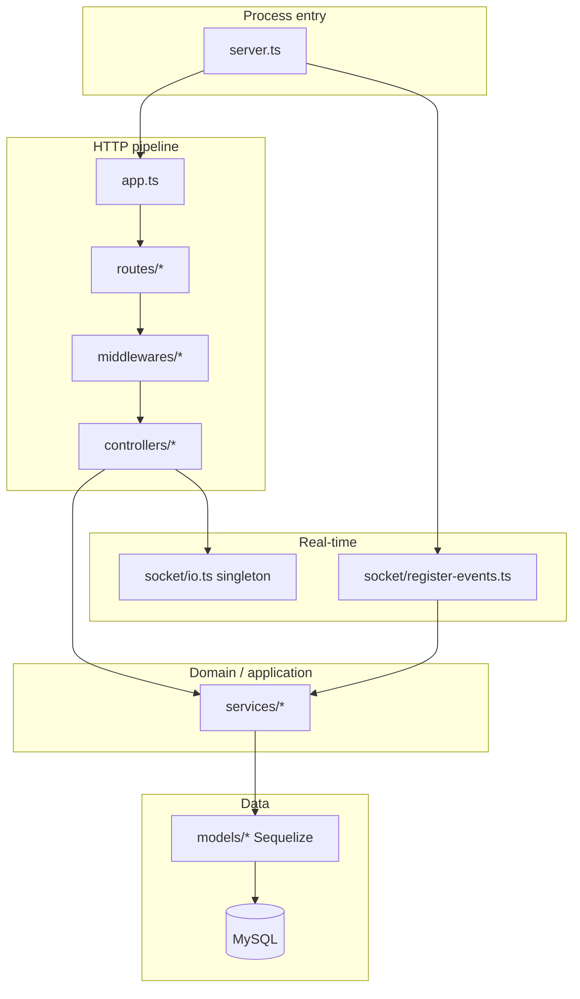
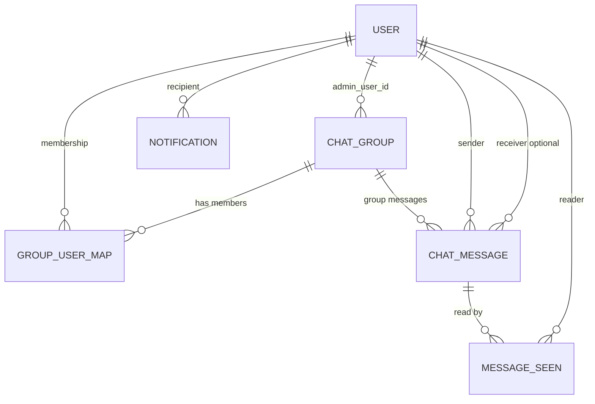
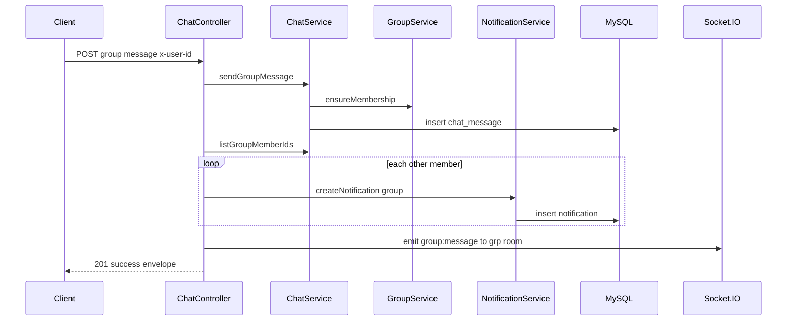

# High Level Design (HLD) — Chat Application Backend

**Document type:** High-level architecture and behavior (implementation-agnostic where possible, grounded in the current codebase).  
**Scope:** HTTP API under `/api/v1`, Socket.IO real-time layer, MySQL persistence via Sequelize, and cross-cutting concerns in `src/`.

---

## 1. Purpose and scope

This backend supports a **multi-user chat product** with:

- **User registry** (create/list users and a paginated “directory” for starting direct chats).
- **Group chat** (groups with a single admin, membership lifecycle, group messages).
- **Direct (1:1) chat** (messages stored with sender/receiver, no `group_id`).
- **Read receipts** (per message per user, idempotent “mark seen”).
- **In-app notifications** (persisted rows per user; list and mark read).
- **Presence and online indicators** (in-memory tracking keyed by Socket.IO connections and group room membership).

The HLD describes **what the system does**, **major components**, **data concepts**, **integration points**, and **notable constraints**. It does not specify low-level function signatures unless needed for clarity.

---

## 2. System context

- **Clients** talk to the server over **HTTP** (JSON) and **WebSocket** (Socket.IO).
- **Identity for HTTP** (for protected routes) is conveyed via a custom header (see §7.2).
- **Identity for WebSocket** is taken from the Socket.IO handshake auth payload (see §6.2).

---

## 3. Technology stack

| Layer | Technology |
|--------|------------|
| Runtime | Node.js (CommonJS `require` / TypeScript compiled via `ts-node-dev`) |
| HTTP framework | Express 5 |
| Real-time | Socket.IO 4 |
| ORM | Sequelize 6 |
| Database | MySQL (via `mysql2`) |
| Validation | Joi |
| Security headers | Helmet |
| CORS | `cors` (configured to allow all origins in code) |

**Configuration** is loaded from environment variables and defaults (`src/config/env.ts`): `NODE_ENV`, `PORT`, optional `EXPOSE_API_DOCS`, and MySQL connection parameters (`DB_HOST`, `DB_PORT`, `DB_NAME`, `DB_USER`, `DB_PASSWORD`, `DB_SOCKET_PATH`).

---

## 4. Logical architecture

### 4.1 Layered structure

| Layer | Responsibility |
|--------|----------------|
| **`server.ts`** | Bootstraps DB, Sequelize `sync`, HTTP server, Socket.IO server, graceful shutdown (sockets + DB + HTTP). |
| **`app.ts`** | Express app: CORS, Helmet, JSON body parser, mounts API router at `/api/v1`, 404 handler, global error handler. |
| **Routes** | Maps URL paths and HTTP verbs to controllers; attaches validation and auth middleware where required. |
| **Middlewares** | Request validation (Joi), user context (`x-user-id`), centralized errors, unknown routes. |
| **Controllers** | HTTP-specific orchestration: parse params/query, call services, optional Socket.IO emits, shape JSON responses. |
| **Services** | Business rules, Sequelize queries, authorization checks (e.g. group admin, membership). |
| **Models** | Sequelize model definitions, indexes, associations (`src/models/index.ts`). |
| **Socket layer** | Connection lifecycle, rooms, event names, delegates persistence to shared services. |

### 4.2 Canonical API prefix

All REST resources are under:

**`/api/v1`**

---

## 5. Data design (conceptual schema)

### 5.1 Entity-relationship overview

### 5.2 Tables (logical model)

| Table | Primary key | Purpose |
|--------|-------------|---------|
| **`user`** | `user_id` | Registered person: name, unique `email_id`, `is_active`, timestamps. |
| **`chat_group`** | `group_id` | Group conversation: `group_title`, fixed `group_type` enum (`group`), `admin_user_id`, `is_active`. |
| **`group_user_map`** | `group_user_map_id` | Membership: `(group_id, user_id)` unique among non-exited semantics enforced in app; `is_admin`, `joined_at`, `exited_at`, `is_exited`. |
| **`chat_message`** | `message_id` | Message row: optional `group_id` (null = direct), `sender_user_id`, optional `receiver_user_id`, `message_text`, `message_type` (`text`), `sent_at`. |
| **`message_seen`** | `message_seen_id` | Read receipt: unique `(message_id, user_id)`, `seen_at`. |
| **`notification`** | `notification_id` | User inbox: `notification_type` (`group` \| `direct` \| `system`), title/body, `is_read`, optional `group_id` / `related_user_id`, `created_at`. |

### 5.3 Sequelize associations (application-level)

- **ChatGroup** → **User** as `admin` (`admin_user_id`).
- **GroupUserMap** → **ChatGroup**, **User**.
- **ChatMessage** → **ChatGroup**, **User** as `sender` and `receiver`.
- **MessageSeen** → **ChatMessage**, **User**.
- **Notification** → **User**.

### 5.4 Physical / sync behavior

- On startup, **`sequelize.sync`** runs with **`alter: true` in development** only (schema drift correction); logging is environment-dependent.
- Models use **manual `created_at` / `updated_at`** columns where defined (`timestamps: false` on models).

---

## 6. Real-time design (Socket.IO)

### 6.1 Server setup

- Socket.IO attaches to the **same HTTP server** as Express.
- CORS for Socket.IO is permissive (`origin: "*"`) in code.
- A **module-level `io` reference** is set at startup for use from HTTP controllers (`setSocketServer` / `io` export).

### 6.2 Authentication at connection

- On `connection`, the server reads **`user_id` from `socket.handshake.auth`**.
- If missing or invalid, the socket is **disconnected** immediately.

### 6.3 Rooms and presence

On successful connection:

1. **User room:** `usr:{user_id}` — used to target direct messages to a user.
2. **Presence:** the user is tracked as online via **`presenceService`** (map of `user_id` → set of `socket_id`s).
3. **Broadcast:** `user:presence` with `{ user_id, is_online: true }` is emitted **globally** to all clients.
4. **Group rooms:** For each group returned by **`GroupService.listMyGroups`**, the socket joins `grp:{group_id}` and updates **`presenceService.joinGroup`**, then notifies that group room with **`group:presence`** (includes `online_cnt`).

On **disconnect**, socket maps and group presence are updated; **`user:presence`** and per-group **`group:presence`** are emitted again with updated counts.

### 6.4 Socket event protocol (server-handled)

| Client event (in) | Server behavior |
|-------------------|-----------------|
| `chat:group:send` `{ group_id, message_text }` | Persists via **`ChatService.sendGroupMessage`**, emits **`group:message`** to room `grp:{group_id}`. |
| `chat:direct:send` `{ receiver_user_id, message_text }` | Persists via **`ChatService.sendDirectMessage`**, emits **`direct:message`** to `usr:{sender}` and `usr:{receiver}`. |

**Server → client** events used in codebase include: `group:message`, `direct:message`, `user:presence`, `group:presence`, and (from HTTP) `message:seen` (see §8.3).

### 6.5 HTTP vs Socket parity (conceptual)

- **Persistence** for messages uses the same **`ChatService`** whether the client uses REST or Socket.IO for send.
- **Notifications** for new messages are created in **HTTP controllers** for REST sends; **Socket-only sends do not invoke notification creation** in the current socket handler implementation. This is an important **behavioral asymmetry** for product and client design.

---

## 7. HTTP API design

### 7.1 Response envelope

Successful and error responses use a **uniform JSON shape** (`success`, `message`, optional `data` / `errors`) via **`successResponse` / `errorResponse`**.

Validation failures return **400** with a list of Joi messages under `errors`.

### 7.2 User identity and authorization model

- **Protected API surface** (everything mounted **after** `requireUserContext` on the API router) requires header **`x-user-id`** with a **positive integer**.
- Invalid or missing header → **401** JSON error.
- **There is no password, JWT, or session store** in this codebase: the caller is trusted to supply the correct `x-user-id`. This is suitable only for **trusted networks, demos, or a gateway that sets the header**; production hardening would replace this pattern.

**Route-level nuance:**

- **`/users`** base routes for create/list are **before** the global `requireUserContext` on the router aggregator — so **create user** and **list all users** do not require `x-user-id`.
- **`GET /users/directory`** applies **`requireUserContext` on that route only**.

### 7.3 Route catalog

Base: **`/api/v1`**

#### Users (`/users`)

| Method | Path | Auth (`x-user-id`) | Function |
|--------|------|--------------------|----------|
| POST | `/users` | No | Create user (Joi body). |
| GET | `/users` | No | List all users (newest first by id). |
| GET | `/users/directory` | Yes | Paginated directory for DM: excludes self; includes `is_online`; query `page`, `limit` (default 10, max 50). |

#### Groups (`/groups`) — all require `x-user-id`

| Method | Path | Function |
|--------|------|----------|
| GET | `/groups/my` | List active groups the user is a member of (non-exited mapping). |
| POST | `/groups` | Create group: title + optional `user_ids`; creator is admin and member. |
| PUT | `/groups/:group_id` | Update title; **group admin only**. |
| GET | `/groups/:group_id/members` | List active members (user rows). |
| POST | `/groups/:group_id/members` | Add members by ids; **admin only**; skips users already active in group. |
| DELETE | `/groups/:group_id/members/:user_id` | Soft-remove member (`is_exited`); **admin only**; admin cannot remove self. |
| POST | `/groups/:group_id/admin/:user_id` | Transfer admin to an active member; **current admin only**. |

#### Chat (`/chat`) — all require `x-user-id`

| Method | Path | Function |
|--------|------|----------|
| GET | `/chat/groups/:group_id/messages` | Group history (member-only); ordered ascending by `sent_at`; **limit 500** newest window implied by query implementation (fixed limit in service). |
| POST | `/chat/groups/:group_id/messages` | Send group message; persists; **notifies** other members via notifications; **Socket.IO** `group:message` to `grp:{group_id}`. |
| GET | `/chat/groups/:group_id/online` | Member-only; returns `online_user_ids` and count from **in-memory presence** (Socket.IO join semantics). |
| GET | `/chat/direct/:peer_user_id/messages` | Direct history between auth user and peer; `group_id` null; **limit 500**. |
| POST | `/chat/direct/:peer_user_id/messages` | Send DM; **notification** to peer; **Socket.IO** to both user rooms. |
| GET | `/chat/direct/:peer_user_id/online` | Boolean `is_online` for peer from presence service. |
| POST | `/chat/messages/:message_id/seen` | Idempotent read receipt; emits **`message:seen`** globally via `io.emit` with aggregate seen users. |

#### Notifications (`/notifications`) — all require `x-user-id`

| Method | Path | Function |
|--------|------|----------|
| GET | `/notifications` | Paginated list; query `page`, `limit` (default 10, max 50), `status` = `all` \| `read` \| `unread`; includes **`unread_count`**. |
| POST | `/notifications/:notification_id/read` | Mark one notification read if it belongs to the user. |

### 7.4 Validation rules (request bodies)

| Area | Rules (summary) |
|------|-----------------|
| User create | `first_name` 2–100 chars, `last_name` 1–100, valid `email_id`. |
| Group create | `group_title` 2–120; `user_ids` array of positive integers (default empty). |
| Group update | `group_title` 2–120. |
| Add members | `user_ids` non-empty array of positive integers. |
| Send message | `message_text` 1–2000 chars. |

Unknown JSON keys are **stripped** by Joi options in middleware.

---

## 8. Major behavioral flows

### 8.1 Group message via REST (end-to-end)

### 8.2 Direct message via REST

Similar to §8.1, but **no membership check** at service level for DM send; **one notification** to the receiver; **Socket.IO** emits to **both** participants’ user rooms.

### 8.3 Mark message seen (REST + broadcast)

- **ChatService** loads message, **`findOrCreate`** on **`message_seen`** for `(message_id, user_id)`.
- Controller loads all seen rows for that message and emits **`message:seen`** with `{ message_id, seen_users }` using **`io.emit`** (all connected clients receive it).

### 8.4 Group admin operations

Central pattern: **`GroupService.getGroupAsAdmin`** ensures group exists, is active, and **`chat_group.admin_user_id`** equals caller. Member operations use **`GroupUserMap`** with **`is_exited: false`** for “active” membership.

---

## 9. Cross-cutting concerns

| Concern | Implementation concept |
|---------|-------------------------|
| **Async errors** | Controllers wrapped in **`asyncHandler`** → errors forwarded to Express error middleware. |
| **Domain errors** | **`HttpError`** carries HTTP status; error middleware maps to JSON and hides 500 details in production. |
| **404** | Unmatched routes return JSON **`Route not found: {originalUrl}`**. |
| **Pagination** | Shared pattern: page ≥ 1, capped limit; total pages computed with `ceil`. |
| **Message history caps** | Group and direct **`findAll`** use **`limit: 500`** — clients see at most the last 500 rows by current ordering/limit behavior. |
| **Graceful shutdown** | On SIGINT/SIGTERM: disconnect sockets, close Socket.IO, close Sequelize, close HTTP server. |

---

## 10. Non-functional characteristics (as implemented)

| Topic | Behavior |
|--------|----------|
| **Availability** | Single-process; presence is **volatile** (memory only). |
| **Scalability** | **Socket.IO and presence do not span multiple server instances** without additional infra (Redis adapter, shared presence store). |
| **Security** | Helmet + JSON limits implicit to Express; **no authentication** beyond header/socket self-assertion; CORS wide open. |
| **Observability** | Console logging for startup/errors; Sequelize SQL logging in development. |

---

## 11. Documented limitations and assumptions

1. **`x-user-id` and `handshake.auth.user_id` are trust boundaries** — any client that can reach the server can impersonate a user unless an outer gateway enforces identity.
2. **Direct messages** are not restricted by “friendship” or “allowed peers” in services — any pair of user IDs can exchange DMs.
3. **Socket sends** do not create **notifications** (unlike REST group/direct sends).
4. **`message:seen`** is a **global broadcast** — high fan-out on large deployments.
5. **`group_id` / `receiver_user_id`** combinations rely on **convention** (direct vs group) rather than a DB check constraint in application code reviewed here.
6. **`env.exposeApiDocs`** exists in config but **no OpenAPI/Swagger route** is mounted in `app.ts` in the reviewed tree — flag reserved for future use.

---

## 12. Glossary

| Term | Meaning in this system |
|------|-------------------------|
| **Auth user** | The user id established from `x-user-id` (HTTP) or handshake (socket). |
| **Soft exit** | Member removed from group via `is_exited` / `exited_at`, not row delete. |
| **Presence** | Derived from active Socket.IO connections and group joins, not stored in MySQL. |
| **Directory** | Paginated list of other users enriched with online flag for picking a DM peer. |

---

## 13. Revision note

This HLD is derived from the **`src/`** layout and behavior at documentation time. When the codebase changes, update **§5 (data)**, **§6 (sockets)**, and **§7 (routes)** first — they are the contracts clients and operators depend on.
