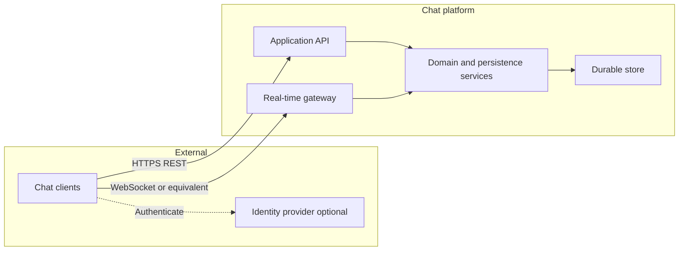
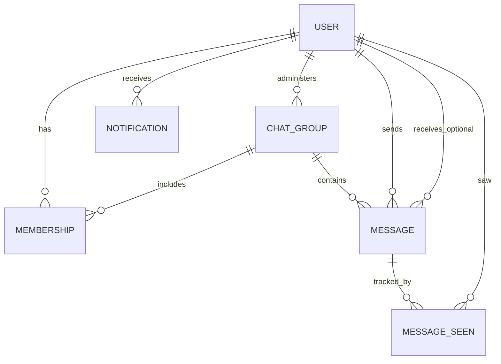

# High Level Design (Requirements-Driven)

 

## 1. Document control

| Item | Description |
|------|-------------|
| **Purpose** | Define *what* the chat backend must provide, *how* major pieces fit together, and *which* constraints govern acceptable solutions. |
| **Audience** | Engineering, architecture review, security review, QA test planning. |
| **Out of scope** | Low-level design (class diagrams, exact SQL), UI design, client app internals. |

---

## 2. Vision and objectives

### 2.1 Vision

Enable registered people to **communicate in groups and one-to-one**, see **who is available**, know when **messages were read**, and receive **persistent in-app notifications** when activity concerns them.

### 2.2 Business objectives

- Support **many concurrent users** and **many groups** without data loss for messages and membership.
- Provide **both** request/response operations (profile, history, administration) and **near-real-time** delivery for new messages and presence changes.
- Keep **administration of groups** explicit (single accountable admin per group, transferable role).

### 2.3 Success criteria (measurable intent)

- Users can create an identity, discover others, join groups, send/receive messages, and review notification history.
- Message history can be retrieved in bounded time for typical conversation sizes.
- Online/offline and “typing” level indicators may be phased; **online presence** is in scope for this HLD.

---

## 3. Stakeholders and actors

| Actor | Interest |
|--------|----------|
| **End user** | Chat, presence, notifications, read receipts. |
| **Group admin** | Create/update group, add/remove members, transfer admin. |
| **System operator** | Deploy, monitor, rotate credentials, restore backups. |
| **Client applications** | Stable contracts (APIs and real-time channels), predictable error semantics. |

---

## 4. System context

**Narrative:** Clients use a **documented REST API** for commands and queries that fit a request/response model. They use a **long-lived real-time channel** for events that must appear without polling (new messages, presence). A **core service layer** enforces rules and writes to a **durable relational or document store** (technology-neutral). An external **identity provider** is optional but recommended for production (see §11).

---

## 5. Scope of capabilities

### 5.1 In scope

| Domain | Capabilities |
|--------|----------------|
| **Users** | Register user, list users, paginated directory for selecting chat partners (excluding self), basic active/disabled flag. |
| **Groups** | Create group with title and initial members; list my groups; list members; update title; add members; remove member (soft leave); transfer admin; enforce single admin. |
| **Group chat** | Send and retrieve messages within a group; only members may read/send. |
| **Direct chat** | Send and retrieve messages between two users without a group container. |
| **Read receipts** | Record that a user has seen a message; idempotent; support querying who has seen a message for client display. |
| **Notifications** | Persist notifications per recipient (group activity, direct message, system); paginated list with read/unread filter; mark individual notification read. |
| **Presence** | Indicate whether a user has an active real-time session; optional per-group “who is online now” for members. |

 
---

## 6. Functional requirements (summary)

Requirements are grouped by capability. Implementations may map them to epics and user stories.

### 6.1 User management

| ID | Requirement |
|----|----------------|
| FR-U-01 | The system shall allow creation of a user with given name and unique email (or equivalent unique identifier). |
| FR-U-02 | The system shall allow listing all users for administrative or onboarding scenarios. |
| FR-U-03 | The system shall expose a **paginated directory** of users suitable for starting a direct chat, excluding the requesting user. |
| FR-U-04 | Directory entries shall support an **online** indicator when presence is available. |

### 6.2 Group lifecycle

| ID | Requirement |
|----|----------------|
| FR-G-01 | Each group shall have exactly **one admin** at any time, recorded on the group. |
| FR-G-02 | Creating a group shall record the creator as admin and as a member. |
| FR-G-03 | Only the admin shall update the group title, add members, remove members, or transfer admin. |
| FR-G-04 | Removing a member shall be modeled as **leaving** (historical membership may be retained). |
| FR-G-05 | The admin shall not remove themselves without first transferring admin to another active member. |
| FR-G-06 | Transferring admin shall require the target to be an **active** member; after transfer, the previous admin is a normal member unless removed. |

### 6.3 Messaging

| ID | Requirement |
|----|----------------|
| FR-M-01 | Group messages shall be associated with a group and a sender; only **active members** may send or fetch group history. |
| FR-M-02 | Direct messages shall be associated with sender and recipient and shall not require a group. |
| FR-M-03 | Messages shall support at least **text** content with a defined maximum length policy. |
| FR-M-04 | Message history endpoints shall return messages in **chronological order** and shall define a **maximum page or window** to protect performance. |
| FR-M-05 | Sending a message shall **persist** it before any real-time fan-out is considered successful (at-least-once delivery to store). |

### 6.4 Read receipts

| ID | Requirement |
|----|----------------|
| FR-R-01 | A user may mark a message as seen; duplicate submissions shall not create inconsistent state (**idempotent** per user per message). |
| FR-R-02 | The system shall support retrieving the set of users who have seen a given message. |

### 6.5 Notifications

| ID | Requirement |
|----|----------------|
| FR-N-01 | When a user should be informed of an event (e.g. new group message, new direct message), the system shall create a **durable notification** for that user. |
| FR-N-02 | Notifications shall carry type, title, body, and optional references (e.g. group, related user). |
| FR-N-03 | Users shall list notifications with pagination and filter by read/unread/all. |
| FR-N-04 | Listing shall include an **unread count** for badge display. |
| FR-N-05 | Users shall mark a notification as read; only the owner may update their notification. |

### 6.6 Presence

| ID | Requirement |
|----|----------------|
| FR-P-01 | When a user maintains an authorized real-time connection, they shall be considered **online**. |
| FR-P-02 | When all connections for a user end, they shall be considered **offline** (subject to reconnect grace policy if adopted). |
| FR-P-03 | Group members authorized to view a group shall be able to request **how many or which users** in that group are currently online, subject to privacy policy. |

### 6.7 Real-time delivery (non-functional coupling)

| ID | Requirement |
|----|----------------|
| FR-RT-01 | New group messages shall be deliverable to **online members** without requiring a full history refetch. |
| FR-RT-02 | New direct messages shall be deliverable to **both parties** when online. |
| FR-RT-03 | Presence changes shall be broadcast to interested subscribers per product policy (global vs per-contact vs per-group). |

---

## 7. Conceptual information model

Entities and relationships describe **logical data**, not physical tables.

| Entity | Key ideas |
|--------|-----------|
| **USER** | Identity, display name fields, unique contact key (e.g. email), active flag, audit timestamps. |
| **CHAT_GROUP** | Title, type (group), link to current admin, active flag. |
| **MEMBERSHIP** | User–group association; admin flag on membership may mirror or delegate group-level admin; **left** state with timestamps. |
| **MESSAGE** | Text payload, sent time, sender; either **group scope** or **direct scope** (mutually exclusive pattern). |
| **MESSAGE_SEEN** | Unique per (message, user), seen timestamp. |
| **NOTIFICATION** | Recipient, type, title, body, read flag, optional foreign keys to group or other user, created time. |

**Integrity rules (logical):**

- A message is either **group-scoped** or **direct-scoped**; validation must reject ambiguous combinations.
- Membership for messaging must be **active** (not left).
- Notifications always belong to exactly one recipient user.

---

## 8. Application programming interface (logical REST design)

Versioned base path concept: **`/api/v1`**. Methods below are illustrative of **resource responsibilities**; naming may vary in implementation.

### 8.1 Users

| Operation | Intent |
|-----------|--------|
| Create user | Register with validated profile fields. |
| List users | Full list for admin/onboarding. |
| Directory (paginated) | List peers for DM picker; supports `page`, `limit` caps; excludes caller. |

### 8.2 Groups

| Operation | Intent |
|-----------|--------|
| List my groups | Groups where caller has active membership. |
| Create group | Title + optional initial member ids; caller becomes admin and member. |
| Update group | Title change; admin only. |
| List members | Active members for a group. |
| Add members | Admin only; idempotent for already-active members. |
| Remove member | Admin only; soft leave; self-removal rules per FR-G-05. |
| Transfer admin | Admin only; target must be active member. |

### 8.3 Chat

| Operation | Intent |
|-----------|--------|
| Group history | Member-only read; chronological order; bounded result set. |
| Send group message | Member-only write; persist then optional real-time fan-out. |
| Group online snapshot | Member-only; returns counts or ids per privacy decision. |
| Direct history | Between caller and one peer; bounded result set. |
| Send direct message | Persist; notify recipient per FR-N-01. |
| Peer online | Boolean or richer state per policy. |
| Mark seen | Idempotent receipt for one message for caller. |

### 8.4 Notifications

| Operation | Intent |
|-----------|--------|
| List | Pagination; filter read/unread/all; include unread aggregate. |
| Mark read | Single notification owned by caller. |

### 8.5 Standard response contract

All JSON responses should follow a **uniform envelope**: success flag, human-readable message, optional payload, optional structured validation errors (field-level or list of messages). HTTP status codes should align with semantics (201 for creation, 400 validation, 401/403 authz, 404 not found, 409 conflicts if used).

---

## 9. Real-time design (requirements)

### 9.1 Channel

Clients maintain an **authorized, long-lived connection** to a real-time gateway. The authorization binding must identify the **same user principal** as the REST API uses, to avoid impersonation.

### 9.2 Rooms or topics

| Concept | Use |
|---------|-----|
| **Per-user inbox** | Targeted delivery of direct messages and possibly personal signals. |
| **Per-group fan-out** | Targeted delivery of group messages and optional group presence. |

### 9.3 Events (illustrative names)

| Direction | Event | Purpose |
|-----------|--------|---------|
| Server → client | New group message | Push message payload to group subscribers. |
| Server → client | New direct message | Push to sender and recipient personal channels. |
| Server → client | User presence | Online/offline transitions. |
| Server → client | Group presence | Optional count or membership subset for a group. |
| Server → client | Read receipt update | Notify interested clients when seen set changes. |
| Client → server | Send group message | Optional alternate ingress; must honor same rules as REST. |
| Client → server | Send direct message | Optional alternate ingress; must honor same rules as REST. |

### 9.4 Consistency requirement

Whether the client sends via REST or the real-time channel, **the same domain validations and side effects** (persistence, notifications policy) shall apply unless explicitly documented otherwise.

---
 

## 10. Security and privacy (requirements)

| ID | Requirement |
|----|----------------|
| SEC-01 | All external traffic shall use **TLS**. |
| SEC-02 | Callers shall be **authenticated**; anonymous access is limited to explicitly public operations (if any). |
| SEC-03 | **Authorization** shall be enforced per resource (e.g. only members read group messages; only admin mutates group). |
| SEC-04 | User identifiers in headers alone are **insufficient** for production; use standards-based tokens (e.g. OAuth2 bearer, session cookies) validated server-side. |
| SEC-05 | Notifications and messages shall be **scoped** so one user cannot read another’s private data by identifier guessing (authorize by ownership/membership). |
| SEC-06 | Rate limiting and payload size limits shall protect the API and real-time layer from abuse. |

---

## 11. Non-functional requirements

| Area | Requirement |
|------|-------------|
| **Performance** | History endpoints shall complete within agreed SLAs under expected concurrency; pagination mandatory for large lists. |
| **Reliability** | No acknowledged write shall be lost; use transactions where multiple rows must move together (e.g. admin transfer). |
| **Availability** | Graceful degradation: if real-time is down, REST history still works. |
| **Observability** | Structured logs, metrics for error rate, latency, and connection counts; distributed tracing recommended for multi-service future. |
| **Maintainability** | Clear module boundaries: identity, groups, messaging, notifications, presence, real-time adapter. |
| **Portability** | Domain logic should minimize coupling to a specific vendor SDK so the real-time transport can be swapped. |
 
 
 

 