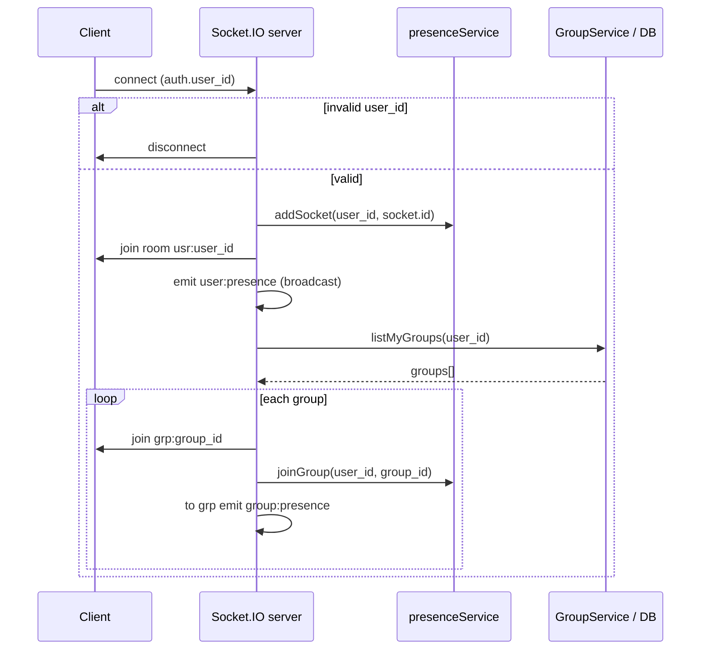
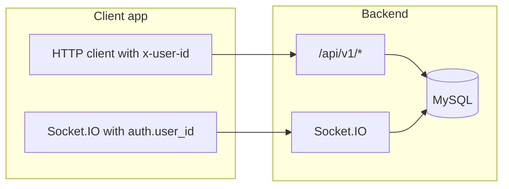

# Socket.IO — Client and Server Integration Guide

This document explains how **real-time** behavior works in this backend: how the **HTTP server** and **Socket.IO** share one port, how a **client connects**, which **rooms** and **events** exist, and how that fits together with the **REST API** (`x-user-id`). It matches the code in `src/server.ts`, `src/socket/register-events.ts`, `src/socket/io.ts`, `src/services/presence.service.ts`, and `src/controllers/chat.controller.ts`.

---

## 1. Big picture

| Concern | Detail |
|---------|--------|
| **Transport** | Socket.IO (WebSocket with HTTP long-polling fallback) on the **same process and port** as Express. |
| **Base URL** | Same host and port as REST, e.g. `http://localhost:5000` when `PORT=5000` in `.env`. |
| **Socket path** | Default **`/socket.io/`** (not customized in this project). |
| **REST identity** | Header **`x-user-id`** on HTTP. |
| **Socket identity** | **`handshake.auth.user_id`** (number). Invalid or missing → server **disconnects** the socket immediately. |
| **Persistence** | Messages are stored via **`ChatService`** whether they arrive over **REST** or **Socket**; only **REST** chat paths create **notifications** and only **REST** `mark seen` emits **`message:seen`**. |

There is **no separate “socket port”**: the client opens one TCP connection to the server; HTTP requests and the Socket.IO session both use that listener.

---

## 2. How the server opens the socket “route”

### 2.1 Startup sequence

1. **`http.createServer(app)`** — Node HTTP server wraps the Express `app`.
2. **`new SocketServer(httpServer, { cors: ... })`** — Socket.IO attaches to that HTTP server and handles upgrade/handshake on the default path.
3. **`registerSocketEvents(socketServer)`** — Registers the **`connection`** handler (per client).
4. **`httpServer.listen(env.port)`** — Binds the port (e.g. **5000** from `.env`).

So the socket is **not** a separate Express route like `/api/v1/...`. It is bound at the **HTTP server** level. Any client that connects to `http://<host>:<port>` with a Socket.IO client automatically negotiates on **`/socket.io/`**.

### 2.2 CORS (server)

```text
cors: { origin: "*", methods: ["GET", "POST", "PUT", "DELETE"] }
```

Browsers loading your SPA from another origin can still open the socket, subject to normal browser rules.

### 2.3 REST + socket together (`io` singleton)

After the Socket.IO server is created, **`setSocketServer(socketServer)`** stores it in **`src/socket/io.ts`** as **`io`**. HTTP handlers (for example **`ChatController`**) import **`io`** and call **`io.to(room).emit(...)`** so **REST** actions also push real-time updates to connected clients.

---

## 3. Connection flow (server side)

When a client successfully completes the Socket.IO handshake, the server runs **`socketServer.on("connection", async (socket) => { ... })`**.



**Steps in prose**

1. Read **`user_id = Number(socket.handshake.auth?.user_id)`**.
2. If falsy or **`NaN`** → **`socket.disconnect()`** and stop (no error payload to the client in this code path).
3. **`presenceService.addSocket(user_id, socket.id)`** — tracks this tab/device.
4. **`socket.join("usr:" + user_id)`** — user-scoped room for DMs and presence-related fan-out.
5. **`socketServer.emit("user:presence", { user_id, is_online: true })`** — **every** connected socket receives it (global broadcast).
6. Load **`GroupService.listMyGroups(user_id)`** from DB.
7. For each group: **`socket.join("grp:" + group_id)`**, **`presenceService.joinGroup(user_id, group_id)`**, then **`socketServer.to("grp:" + group_id).emit("group:presence", { group_id, online_cnt })`** so others in that group see an updated count.

**Important:** Group rooms are determined **once at connect time**. If the user is added to a new group while already connected, they **do not** auto-join `grp:<new_id>` until they **reconnect** (unless you add that feature later).

---

## 4. How the client connects

### 4.1 URL

Use the **same origin** as the API, without `/api/v1`:

| `.env` | Example client URL |
|--------|-------------------|
| `PORT=5000` | `http://localhost:5000` |

Production would be `https://your-api.example.com` (Socket.IO follows `http` vs `https`).

### 4.2 Required auth object

The server expects a **numeric** `user_id` in the handshake **`auth`** field (Socket.IO v3+).

**Browser / SPA (socket.io-client v4)**

```javascript
import { io } from "socket.io-client";

const userId = 1; // same logical user as x-user-id on REST

const socket = io("http://localhost:5000", {
  auth: {
    user_id: userId,
  },
  // optional: transports: ["websocket"] to skip polling
});

socket.on("connect", () => {
  console.log("connected", socket.id);
});

socket.on("disconnect", (reason) => {
  console.log("disconnected", reason);
});
```

**Node script**

```javascript
const { io } = require("socket.io-client");

const socket = io("http://localhost:5000", {
  auth: { user_id: 42 },
});
```

If **`auth.user_id`** is missing or not a positive number, the server disconnects; the client may see a short-lived connection or a disconnect reason depending on timing.

### 4.3 Aligning REST and socket user

Use the **same integer user id** for:

- **`x-user-id`** on REST calls under `/api/v1/groups`, `/api/v1/chat`, `/api/v1/notifications`, and **`GET /api/v1/users/directory`**.
- **`auth: { user_id }`** on the socket.

Otherwise the user might receive DMs in the socket room for user **A** while sending REST as user **B**, which breaks the product model.

---

## 5. Rooms (server-side abstraction)

| Room name | Who joins | Purpose |
|-----------|-----------|---------|
| **`usr:<user_id>`** | Every authenticated socket for that user | **Direct messages** and ensuring the user receives their own copies of DM events. |
| **`grp:<group_id>`** | Each socket whose **`listMyGroups`** at **connect** included that group | **Group messages** and **group presence** counts for that group. |

Clients **do not** call `join` manually for these names in the current API; the server **`socket.join(...)`** on connection.

---

## 6. Events the client **sends** (`socket.emit`)

These are the only inbound event names implemented in **`registerSocketEvents`**.

### 6.1 `chat:group:send`

| Field | Type | Required |
|-------|------|----------|
| `group_id` | number | yes |
| `message_text` | string | yes |

**Example**

```javascript
socket.emit("chat:group:send", {
  group_id: 10,
  message_text: "Hello from socket",
});
```

**Server behavior**

1. **`ChatService.sendGroupMessage`** — enforces **group membership**; persists **`ChatMessage`** with `group_id` set.
2. **`socketServer.to("grp:" + group_id).emit("group:message", message)`** — all sockets in that group room get the Sequelize message object (serialized as JSON).

**Note:** No **notification** rows are created on this path (unlike REST group send).

There is **no acknowledgment callback** in the current code; failures (e.g. not a member) can reject inside the handler and may surface as an **unhandled rejection** unless you extend the server to catch and ack.

### 6.2 `chat:direct:send`

| Field | Type | Required |
|-------|------|----------|
| `receiver_user_id` | number | yes |
| `message_text` | string | yes |

**Example**

```javascript
socket.emit("chat:direct:send", {
  receiver_user_id: 2,
  message_text: "Hi Bob",
});
```

**Server behavior**

1. **`ChatService.sendDirectMessage`** — persists DM (`group_id` null, `receiver_user_id` set). **No membership check** between users (same as REST).
2. **`socketServer.to("usr:" + sender).emit("direct:message", message)`** and **`to("usr:" + receiver).emit(...)`** — both parties receive the payload if they have an active socket in their user room.

**Note:** No **notification** on this path.

---

## 7. Events the client **receives** (`socket.on`)

### 7.1 `user:presence`

**Payload:** `{ user_id: number, is_online: boolean }`

- **On connect** of a user: **`is_online: true`**, broadcast to **all** clients.
- **On disconnect:** **`is_online`** reflects whether that user still has **another** socket open (`presenceService.isUserOnline`).

Use this for a global “user online/offline” indicator.

### 7.2 `group:presence`

**Payload:** `{ group_id: number, online_cnt: number }`

Emitted to **`grp:<group_id>`** when someone connects or disconnects (after counts update). Use for “N members online in this group” in the UI.

### 7.3 `group:message`

**Payload:** `ChatMessage` JSON (same shape as REST `data` for a group message).

**Sources**

- Socket **`chat:group:send`**
- **REST** `POST /api/v1/chat/groups/:group_id/messages` (**`io.to("grp:...").emit`**)

### 7.4 `direct:message`

**Payload:** `ChatMessage` JSON for a DM.

**Sources**

- Socket **`chat:direct:send`**
- **REST** `POST /api/v1/chat/direct/:peer_user_id/messages`

### 7.5 `message:seen`

**Payload:** `{ message_id: number, seen_users: MessageSeen[] }`

Emitted only from **REST** **`POST /api/v1/chat/messages/:message_id/seen`** via **`io.emit`** — **broadcast to every connected client**, not filtered by group or user room.

---

## 8. Disconnect flow

On **`disconnect`**:

1. **`presenceService.removeSocket(user_id, socket.id)`**
2. **`user:presence`** broadcast with **`is_online`** from **`isUserOnline`** (false if last socket gone).
3. For **each group** from the **snapshot** `groups` at connection time: **`presenceService.leaveGroup`**, then **`group:presence`** to that group room with updated **`online_cnt`**.

If the user’s group list changed during the session, the disconnect loop still uses the **original** `groups` array from connect time.

---

## 9. End-to-end integration pattern (recommended)



1. **Bootstrap user** — e.g. `POST /api/v1/users` or your own login that yields **`user_id`**.
2. **Open socket** — `io(baseUrl, { auth: { user_id } })`.
3. **Subscribe to events** — `group:message`, `direct:message`, `user:presence`, `group:presence`, `message:seen` as needed.
4. **Load history with REST** — `GET .../chat/groups/:id/messages`, `GET .../chat/direct/:peer/messages`.
5. **Send messages** — either **REST** (creates **notifications** for group/DM) or **socket** (real-time only, no notifications). Many apps use **REST for send** so the inbox stays consistent, and rely on **`group:message` / `direct:message`** from the server for other clients; your server already emits those after REST.
6. **Mark read with REST** — `POST .../messages/:message_id/seen`; listen for **`message:seen`** to update read receipts in the UI.
7. **Presence in UI** — combine **`user:presence`**, **`group:presence`**, and REST **`GET .../chat/groups/:id/online`** / **`.../direct/:peer/online`** as needed (`GET` uses the same **`presenceService`** counts).

---

## 10. REST vs socket quick reference

| Action | REST | Socket | Notifications |
|--------|------|--------|-----------------|
| Send group message | Yes | `chat:group:send` | REST only |
| Send DM | Yes | `chat:direct:send` | REST only |
| Receive group/DM message | N/A | Listen `group:message` / `direct:message` | Both paths emit (after persist) |
| Mark seen | Yes | Not implemented | N/A |
| Presence | GET online endpoints | `user:presence`, `group:presence` | N/A |

---

## 11. Operational and security notes

- **Trust model:** Anyone who knows a **`user_id`** can impersonate that user on the socket (`auth`) and on REST (`x-user-id`). Treat as **development / trusted network** unless you add real auth and bind sockets to verified sessions.
- **Scaling:** **`presenceService`** is **in-memory** in one Node process. Multiple server instances would show **incorrect** online counts unless you add a Redis adapter and shared presence.
- **Shutdown:** `SIGINT` / `SIGTERM` disconnects all sockets and closes Socket.IO before closing HTTP and DB (see **`server.ts`**).

---

## 12. File reference

| File | Role |
|------|------|
| `src/server.ts` | Creates HTTP + Socket.IO, calls `registerSocketEvents`, graceful shutdown. |
| `src/socket/register-events.ts` | `connection`, `chat:group:send`, `chat:direct:send`, `disconnect`. |
| `src/socket/io.ts` | Exported **`io`** for REST controllers. |
| `src/services/presence.service.ts` | Socket and per-group online sets. |
| `src/controllers/chat.controller.ts` | REST sends + **`io.to` / `io.emit`**. |

--- 