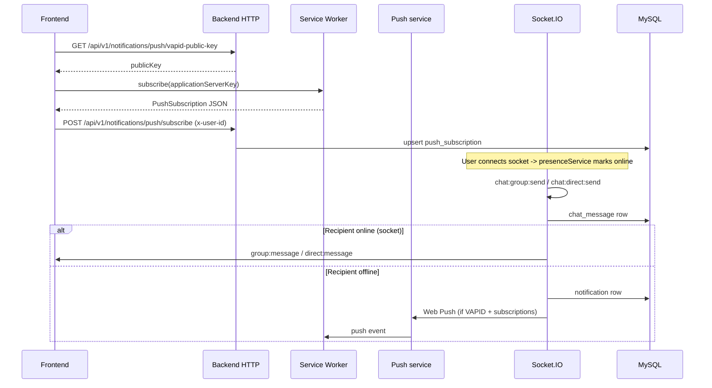

# Web Push notifications — architecture

This document describes how **VAPID Web Push** integrates with the chat backend: configuration, HTTP routes, data stored in MySQL, and when notifications are delivered versus skipped.

**Related:** [Database schema](schema/SCHEMA.md) (`push_subscription`, `notification`), [LLD](LLD/LLD.md) for Socket.IO behavior.

---

## 1. Goals

- Notify users who are **not** connected over Socket.IO (offline / no active socket) when they receive a **group** or **direct** message.
- If the user **is** online (at least one socket tracked in `presenceService`), rely on **real-time socket events only** — no in-app `notification` row and no Web Push for that message.
- When the user is offline: persist a row in `notification` **and** send Web Push to all stored `push_subscription` rows for that user (if VAPID is configured and sends succeed).

---

## 2. VAPID keys (what goes where)

Web Push uses **VAPID** to identify your application server to browser push services (FCM, Mozilla autopush, etc.).

| Secret / artifact | Where it lives | Notes |
|-------------------|----------------|--------|
| **VAPID public key** | `.env` → `VAPID_PUBLIC_KEY`, exposed via API | Safe to give to the browser (`applicationServerKey` in `pushManager.subscribe`). |
| **VAPID private key** | `.env` → `VAPID_PRIVATE_KEY` | **Server-only.** Never expose to clients or commit to public repos. |
| **VAPID subject** | `.env` → `VAPID_SUBJECT` | Contact URI: `mailto:ops@example.com` or `https://your-domain.com` (Web Push spec). |

Generate a key pair:

```bash
npx web-push generate-vapid-keys
```

Copy the output into `.env`. Restart the backend after changes.

---

## 3. High-level flow



---

## 4. HTTP API

Base path: `/api/v1`.

| Method | Path | Auth | Purpose |
|--------|------|------|---------|
| `GET` | `/notifications/push/vapid-public-key` | None | Returns `{ publicKey }` for `pushManager.subscribe`. Returns **503** if VAPID env is incomplete. |
| `POST` | `/notifications/push/subscribe` | Header `x-user-id` | Body: browser `PushSubscription` JSON (`endpoint`, `keys.p256dh`, `keys.auth`). Upserts `push_subscription`. |
| `DELETE` | `/notifications/push/subscribe` | `x-user-id` | Optional JSON `{ "endpoint": "..." }`. If omitted, removes **all** subscriptions for the user. |

Existing notification inbox routes (`GET /notifications`, `POST /notifications/:ntf_id/read`) are unchanged.

---

## 5. Server modules

| Piece | Role |
|-------|------|
| `src/config/env.ts` | Reads `VAPID_*` from the environment. |
| `src/models/push-subscription.model.ts` | Sequelize model for `push_subscription`. |
| `src/services/push-subscription.service.ts` | Upsert/remove/list subscriptions. |
| `src/services/web-push.service.ts` | Configures `web-push`, sends payload JSON, deletes stale subscriptions on 404/410. |
| `src/services/messaging-notify.service.ts` | After a message is stored: for each recipient, if **offline** → `notification` + `WebPushService.sendToUser`. |
| `src/socket/register-events.ts` | After socket-originated sends, calls `MessagingNotifyService`. |
| `src/controllers/chat.controller.ts` | After REST-originated sends, calls `MessagingNotifyService` (replacing unconditional inbox rows for offline-only behavior). |

---

## 6. “Online” definition and edge cases

- **Online** means `presenceService.isUserOnline(user_id)` is true: at least one Socket.IO connection registered for that user after successful `connection` handling.
- **Socket connected, tab background:** still “online”; the client should receive `group:message` / `direct:message` over the socket. No Web Push is sent for that message (avoids duplicate alerts when the app is open).
- **Offline or no subscription:** an in-app `notification` is still created when a message arrives; Web Push is skipped if VAPID is not configured, or the user has no `push_subscription` rows, or the send fails (errors are logged; 404/410 remove the bad subscription).
- **REST vs socket send:** both paths persist the message the same way and call the same `MessagingNotifyService` logic so behavior stays consistent.

---

## 7. Push payload shape

The service worker receives an event whose data is JSON:

```json
{
  "title": "New group message",
  "body": "First 120 characters of text…",
  "data": {
    "kind": "group_message",
    "message_id": "123",
    "group_id": "45"
  }
}
```

Direct messages use `kind: "direct_message"` and include `sender_user_id`. The frontend/service worker can map these fields to deep links or UI state.

---

## 8. Security notes

- Treat `VAPID_PRIVATE_KEY` like any other secret (env, secret manager, never in client bundles).
- Subscription endpoints contain capability URLs; store them server-side only, scoped by `user_id` from `x-user-id` (same lightweight auth model as the rest of this API).
- For production, replace header-based auth with a real session/JWT and tie subscriptions to that identity.

---

## 9. Operational checklist

1. Set `VAPID_PUBLIC_KEY`, `VAPID_PRIVATE_KEY`, `VAPID_SUBJECT` in `.env`.
2. Run the app with `sequelize.sync` (development) or migrate production schema to add `push_subscription`.
3. Frontend: register a service worker, request notification permission, `subscribe` with the public key from `GET …/vapid-public-key`, then `POST …/push/subscribe` with the subscription object.
4. Verify: send a message to a user who has **no** socket connection but **has** a subscription — expect a push and a `notification` row.
