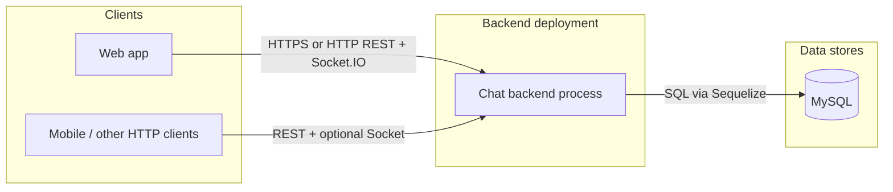
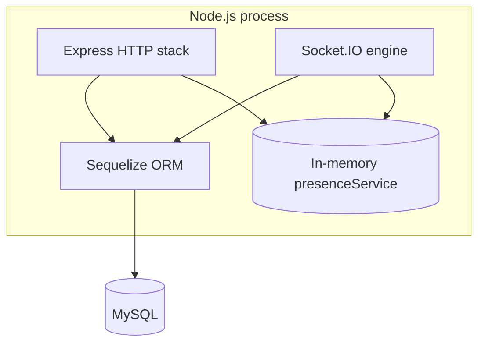
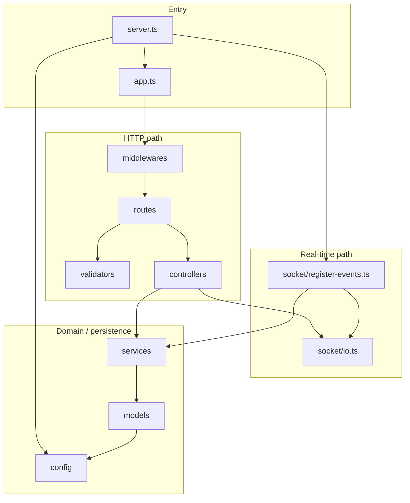
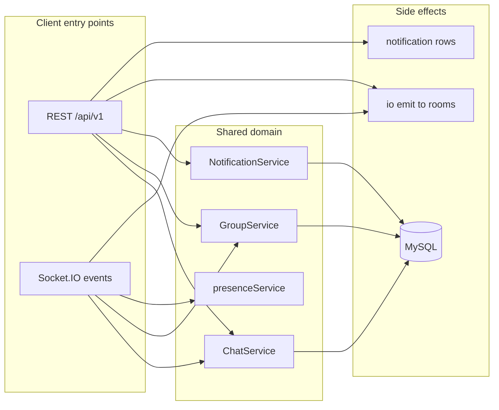
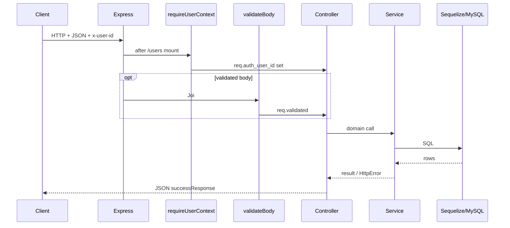
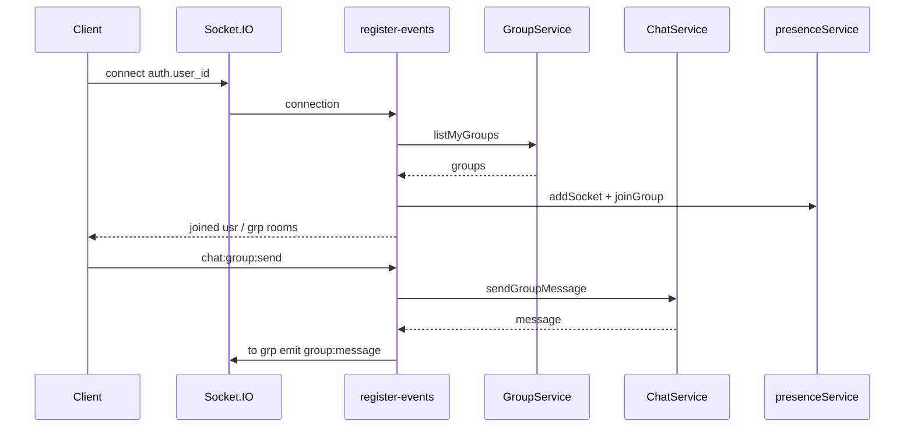
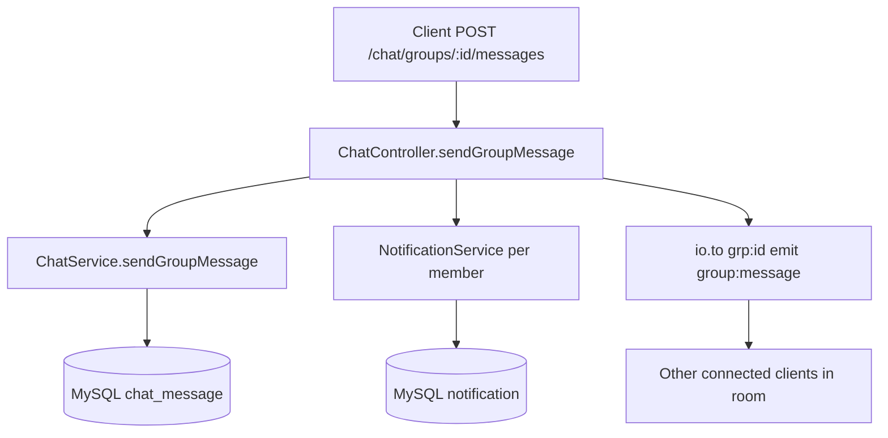
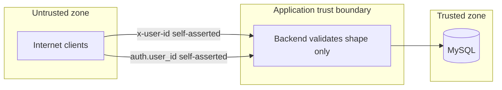

# System design — Chat backend

This document describes the **system-level architecture** of the chat backend under `src/`: major components, how they interact, runtime boundaries, and diagrams for onboarding and design reviews.

---

## 1. System purpose

The system provides:

- **REST API** under `/api/v1` for users, groups, chat history, sending messages (with optional notification side effects), read receipts, and notification inbox.
- **Real-time delivery** over **Socket.IO** on the **same TCP port** as HTTP, including presence-style signals and live message fan-out.
- **Durable state** in **MySQL** via **Sequelize** ORM models.

It is a **monolith**: one Node.js process hosts HTTP, WebSocket upgrade handling, business logic, and in-memory session state for presence.

---

## 2. System context (who talks to whom)

External actors and systems at the highest level.

| Boundary | Description |
|----------|-------------|
| **Clients** | Any consumer that can send **`x-user-id`** on REST and **`auth.user_id`** on the socket. No separate API gateway in code. |
| **Backend** | Single deployable: Express + Socket.IO + application logic. |
| **MySQL** | Authoritative storage for users, groups, memberships, messages, read receipts, notifications. |

---

## 3. Container view (what runs where)

Inside the “Chat backend process” there is **one HTTP server** and **one Socket.IO server** attached to it. There is **no** separate message queue or cache service in this repository.

| Container / module | Responsibility |
|---------------------|------------------|
| **Express** | Routing, JSON body parsing, middleware chain, JSON responses. |
| **Socket.IO** | Persistent connections, rooms, server→client and client→server events. |
| **Sequelize** | Connection pool, queries, `sync` in development. |
| **`presenceService`** | **Process-local** map of connected sockets and “online in group” sets — **not** replicated across multiple Node instances without extra infrastructure. |

---

## 4. Logical component architecture (`src/`)

How code is layered inside the monolith.

| Layer | Folders | Role |
|-------|---------|------|
| **Entry** | `server.ts`, `app.ts` | Bootstraps DB, HTTP+Socket, global middleware order, shutdown. |
| **Routes** | `routes/` | Maps URL paths and HTTP verbs to middleware + controller handlers. |
| **Middleware** | `middlewares/` | Cross-cutting: user context (`x-user-id`), Joi body validation, 404, centralized errors. |
| **Validators** | `validators/` | Joi schemas; keep invalid data out of controllers. |
| **Controllers** | `controllers/` | Parse params/query, call services, shape HTTP status + JSON; **chat** controller also triggers **`io.emit`** / **`io.to`** and notifications. |
| **Services** | `services/` | Business rules and Sequelize access; throw **`HttpError`** for expected failures. |
| **Models** | `models/` | Table mapping, associations in `models/index.ts`. |
| **Socket** | `socket/` | Connection lifecycle, chat socket events, uses same **services** as REST. |
| **Config / utils** | `config/`, `utils/` | Env, DB singleton, `asyncHandler`, API envelope, `HttpError`. |

**Design pattern in use:** classic **three-tier inside one process** — presentation (routes/controllers/socket) → application (services) → data (models/DB), with validation at the edge.

---

## 5. Dual channel design: REST vs Socket

A core system concept is **two entry points** into the same domain services.

| Path | Persistence | Socket fan-out | Notifications |
|------|----------------|----------------|----------------|
| **REST** chat send | Yes | Yes (`io.to` rooms) | Yes (group/DM as implemented) |
| **Socket** chat send | Yes | Yes | **No** (by design in current code) |

Clients that need a consistent **notification inbox** should use **REST** for sends (or the backend should be extended so socket sends also call `NotificationService`).

---

## 6. Request flow (HTTP)

Typical authenticated API call.

**Unauthenticated subset:** `POST /users`, `GET /users` are mounted **before** `requireUserContext` on the API router; other mounts require **`x-user-id`**.

---

## 7. Real-time flow (Socket.IO)

Connect → join rooms from DB → exchange events (see socket doc for event names).

---

## 8. Data and control: chat send (REST) end-to-end

Shows how HTTP, DB, notifications, and socket interact for one use case.

---

## 9. Deployment and scaling considerations

| Topic | Current system | Typical evolution |
|-------|----------------|-------------------|
| **Instances** | One Node process assumed for correct **presence** and room fan-out. | Multiple instances behind a load balancer need **sticky sessions** or Redis adapter for Socket.IO; presence must move to shared store. |
| **Schema** | `sequelize.sync({ alter: true })` in development only. | Production: turn off `alter`, use migrations. |
| **Secrets** | DB password and `x-user-id` trust model. | Vault, real auth (JWT/session), TLS termination at reverse proxy. |
| **Observability** | Console logging in dev for SQL. | Structured logs, metrics, tracing IDs (`request_id` reserved in types but unused). |

---

## 10. Trust boundaries and security (conceptual)

The system **does not verify** that the caller owns the `user_id`; it **trusts** the header and socket auth. Document this clearly for any deployment beyond local demos.

---
 