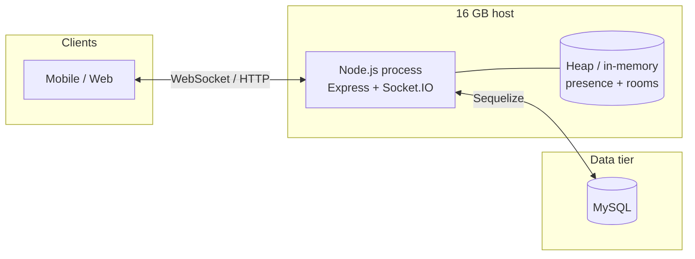

# Daily Active Users (DAU) Capacity Report — 16 GB RAM

**Scope:** This backend repository (single Node.js process, Express, Socket.IO, Sequelize → MySQL).  
**Hardware assumption:** One deployment target with **16 GB total system RAM** (unless stated otherwise).  
**Purpose:** Realistic **DAU** planning from **architecture and first-principles capacity math**, not marketing numbers.

**See also:** [Post-optimization capacity & changelog (16 GB)](./POST_OPTIMIZATION_CAPACITY_16GB.md) — scoped presence, DB pool, Socket.IO tuning, and before/after interpretation.

### 1.1 Before vs after code changes — how much traffic (numbers)

**What “5k–15k traffic” meant all along:** **Peak concurrent users (PCU)** — simultaneous open WebSockets on **one** 16 GB–class Node instance — **not** “messages per second” and not DAU by itself.

| Metric | Before (legacy behavior) | After (current default code) |
|--------|---------------------------|------------------------------|
| **PCU planning band (RAM / heap)** | **~5,000–15,000** concurrent sockets (engineering band; stretch **~15k–20k** if measured) | **Same RAM math** — still plan **~5k–15k** PCU until your load tests say otherwise. Code changes do **not** materially raise bytes-per-socket or heap ceiling. |
| **Practical PCU under high churn** | Global `user:presence` → **~N** deliveries per connect/disconnect; CPU/egress could saturate **below** the RAM band. | **Scoped** presence (default) + lighter Socket.IO defaults → you are **more likely to reach** the RAM-limited PCU band when reconnect rate is high. Treat as **same numbers, higher reliability**, not “2× users.” |
| **Optimistic PCU (single instance)** | **~15,000–20,000** only if measured and CPU was not the limiter. | **~12,000–18,000+** to **~15,000–20,000** still only with tuned heap, external DB, and load proof — **not** a guaranteed step up from code alone. |
| **Sustained chat writes (MySQL)** | Implicit small pool (**often ~5**) capped parallel inserts at the app. | Default **`DB_POOL_MAX=30`** (tunable) removes that artificial cap — planning bands **~50 / ~100–150 / ~200–300 msg/s** (§6.1) apply **when MySQL is sized** for it; RAM does not raise MySQL’s physical insert ceiling. |
| **Connect / presence “traffic” (packets)** | **O(N)** `user:presence` fan-out per churn vs total connections **N**. | **Scoped** to `user:{id}` + `group:{id}` rooms — often **orders of magnitude** fewer presence deliveries when **N** is large (see companion doc). |

**DAU in numbers** is unchanged in formula: **DAU ≈ PCU ÷ p** (§7). Example: **PCU = 10,000** and **p = 5%** → **DAU ≈ 200,000** (illustration). After optimization you do **not** automatically jump to e.g. **30,000** PCU on the same 16 GB box.

---

## 1. Executive summary

| Question | Answer (realistic planning band) |
|----------|----------------------------------|
| What does 16 GB limit directly? | **Peak concurrent WebSocket connections** and process headroom — **not** DAU by itself. |
| Safe peak concurrent (single tuned instance) | **~5,000–10,000** simultaneous connections (conservative to typical). |
| Stretch peak concurrent (measured + tuned) | **~12,000–15,000+** possible depending on overlap, message rates, and DB placement. |
| DAU from RAM alone | **Unbounded in theory** — DAU scales with **how small a fraction of users are online at peak**. |
| Example DAU (if 10k peak concurrent, 5% overlap at peak) | **DAU ≈ 10,000 ÷ 0.05 = 200,000** (order-of-magnitude illustration). |
| Bottleneck besides RAM | **MySQL write throughput**; **pool vs DB limits**; with legacy **global** presence: **CPU/egress** under churn. Default **scoped** presence reduces the presence bottleneck. |

**Bottom line:** **5k–10k DAU** is **comfortably** within capacity for RAM **if** peak concurrent users stay in the low thousands (normal consumer overlap). **Hundreds of thousands of DAU** require **low peak overlap** (or horizontal scale), not more RAM on one box alone.

---

## 2. Architecture (as implemented)

### 2.1 Runtime topology

- **Single Node process** serves HTTP and WebSockets (`src/server.ts`).
- **Socket.IO** default adapter: **in-memory** — all sockets and rooms live in **one** process (`src/socket/io.ts`, `src/socket/register-events.ts`).
- **Presence** is in-process (`src/services/presence.service.ts`): `Map<userId, Set<socketId>>` and `Map<groupId, Set<userId>>` — negligible RAM vs sockets.

### 2.2 Paths that affect scale

| Path | Code location | Capacity note |
|------|----------------|---------------|
| Connect | `registerSocketEvents` | DB read: `GroupService.listMyGroups` (**~45 s TTL cache** per user); joins `user:{id}` and each `group:{id}`. |
| User presence broadcast | `emitUserPresence` → `src/socket/emit-user-presence.ts` (default **scoped**: `user:{id}` + `group:{id}`); `USER_PRESENCE_BROADCAST=global` restores legacy **full broadcast** | **Scoped (default):** CPU/egress scale with **interest set**, not total **N**. **Global:** same as legacy — **N** deliveries per churn. |
| Group presence | `to(\`group:${id}\`).emit("group:presence", …)` | Scoped to group room; scales with members online in that group. |
| Persist message | `ChatService.sendGroupMessage` / `sendDirectMessage` | Each send → `ChatMessage.create` → **MySQL insert** (`src/services/chat.service.ts`). |
| DB config | `src/config/database.ts`, `src/config/env.ts` | Explicit Sequelize **`pool`** (default **`DB_POOL_MAX=30`**, tunable). Legacy implicit pool was often **~5**. |

---

## 3. Definitions

| Term | Definition |
|------|------------|
| **DAU** | Count of **unique users** who had meaningful activity **on a calendar day** (definition should match product analytics). |
| **Peak concurrent users (PCU)** | Maximum **simultaneous open WebSocket connections** (or authenticated sessions if you split HTTP-only) at the worst minute of the day. |
| **Peak overlap ratio (p)** | **PCU ÷ DAU** at that worst minute — **must come from measurement or product guess**; RAM math needs this. |

**Critical distinction:** RAM and Socket.IO care about **PCU**, not DAU.

---

## 4. Assumptions (explicit)

| ID | Assumption | Typical value used in this report |
|----|------------|-------------------------------------|
| A1 | **16 GB** is **total VM/container RAM** | 16 GB |
| A2 | MySQL is **adequately sized** and **not** starving the same 16 GB host (if co-located, reduce Node budget) | External DB or reserved RAM for DB |
| A3 | Node heap tuned with e.g. `--max-old-space-size` so the process can use a large fraction of host RAM safely | ~8–12 GB old space (tuning-dependent) |
| A4 | **Bytes per concurrent socket** (Socket.IO + rooms + buffers + JS overhead) | **80–120 KB** planning; **100 KB** for worked examples |
| A5 | **Headroom** for GC spikes, fragmentation, non-socket work | **40–50%** of heap not counted toward “socket budget” |
| A6 | Message size moderate (short text); no huge binary payloads on socket | Baseline chat |

If A2 or A3 is wrong for your deployment, **reduce PCU ceilings proportionally**.

---

## 5. RAM model and calculation

### 5.1 Formula

Let:

- \(H\) = heap size allocated to Node (bytes), from tuning.
- \(f\) = fraction of heap usable for steady-state sockets after headroom (e.g. **0.5**).
- \(b\) = effective bytes per concurrent socket (e.g. **100 × 1024**).

Then a **first-order ceiling** for concurrent sockets:

\[
\text{PCU}_{\text{ram,ceil}} \approx \frac{H \times f}{b}
\]

### 5.2 Worked example (illustrative only)

Example: **12 GB** old-space target (`--max-old-space-size=12288`), **f = 0.5**, **b = 100 KB**:

- Usable socket budget ≈ \(12 \times 1024^3 \times 0.5 \approx 6.44 \times 10^9\) bytes  
- \(\text{PCU}_{\text{ram,ceil}} \approx 6.44 \times 10^9 / (100 \times 1024) \approx 62{,}900\)  

That number is a **theoretical RAM ceiling** before fragmentation, churn, and non-socket memory. **Production-safe** planning for this stack on one instance is **much lower** — use **5k–15k** as the **engineering band** until load tests prove otherwise.

### 5.3 Planning PCU bands (single instance, 16 GB class host)

| Stance | Peak concurrent (PCU) | Justification |
|--------|-------------------------|---------------|
| **Conservative** | **5,000** | Leaves margin for DB driver, Sequelize, spikes, co-tenancy; use **global** presence or small DB → stay here. |
| **Typical** | **8,000–12,000** | Common “one chat Node” band on 16 GB class hardware with **scoped** presence and tuned pool. |
| **Optimistic** | **15,000–20,000** | Requires measurement, tuned heap, external DB, controlled message rates; not automatic after code changes. |

---

## 6. Database and message traffic (DAU-related but not RAM)

DAU × messages per user per day must fit **insert throughput** at peak, not only average.

### 6.1 Sustained write order of magnitude

From architecture (one insert per message). **After code changes:** app default pool **`DB_POOL_MAX=30`** (was often **~5** implicit) — you can **approach** the bands below **if** MySQL `max_connections` and disk/CPU allow; the **MySQL server** remains the hard ceiling.

| Stance | Sustained writes | Note |
|--------|------------------|------|
| Conservative | **~50 msg/s** | Safe planning for modest MySQL; pool no longer the only limiter. |
| Typical | **~100–150 msg/s** | With reasonable DB tier and indexes. |
| Optimistic | **~200–300 msg/s** | Fast storage, tuned MySQL, monitoring; pool must stay ≤ DB limits. |

### 6.2 Cross-check against DAU (average day)

Let:

- \(M\) = total messages created per day.  
- Spread is non-uniform; define **peak factor** \(k\) = ratio of **peak msg/s** to **average msg/s** over the day.

Average msg/s over 24h:

\[
\text{avg msg/s} = \frac{M}{86{,}400}
\]

Peak requirement (planning):

\[
\text{peak msg/s} \approx k \times \frac{M}{86{,}400},\quad M \approx \text{DAU} \times \text{msgs/user/day}
\]

**Example:** DAU = **50,000**, **20 msgs/user/day** → \(M = 1{,}000{,}000\) → avg ≈ **11.6 msg/s**. If peak is **10×** average → ~**116 msg/s** peak → inside **typical** DB band if DB holds.

**Example:** DAU = **50,000**, **200 msgs/user/day** → \(M = 10{,}000{,}000\) → avg ≈ **116 msg/s**, peak **10×** → ~**1,160 msg/s** → **exceeds** single-box DB planning — **needs scale-out / async / sharding**, not more RAM.

---

## 7. DAU calculation (realistic)

### 7.1 Core identity

\[
\textbf{DAU} \approx \frac{\textbf{PCU}}{\textbf{p}},\quad \textbf{p} = \frac{\textbf{PCU}}{\textbf{DAU}} \text{ at peak minute}
\]

**You cannot compute DAU from RAM without \(p\).** \(p\) comes from **analytics**, geography, and product (workplace vs global consumer).

### 7.2 Reference table (same PCU, different overlap)

Assume **PCU = 10,000** (typical mid planning):

| Peak overlap \(p\) (% of DAU online at peak) | Implied DAU ≈ PCU / p |
|---------------------------------------------|------------------------|
| 20% | **50,000** |
| 10% | **100,000** |
| 5% | **200,000** |
| 2% | **500,000** |
| 1% | **1,000,000** |

Assume **PCU = 5,000** (conservative):

| \(p\) | Implied DAU |
|-------|-------------|
| 10% | **50,000** |
| 5% | **100,000** |
| 2% | **250,000** |

### 7.3 Edge case: “everyone online at once”

If **p → 100%** (every DAU user connected simultaneously):

\[
\textbf{DAU} \approx \textbf{PCU} \approx \textbf{5,000–15,000}
\]

This is the **“RAM equals DAU”** regime (live events, classroom, forced simultaneous usage).

---

## 8. Consolidated scenarios (16 GB class, single instance)

| Scenario | PCU assumed | Peak overlap \(p\) | DAU (RAM story only) | Also check |
|----------|-------------|--------------------|----------------------|------------|
| Small app | 5,000 | 10% | **~50,000** | msgs/day vs §6 |
| Mid app | 10,000 | 5% | **~200,000** | msgs/day vs §6 |
| Sticky / same-time | 10,000 | 20% | **~50,000** | presence churn |
| Simultaneous event | 10,000 | 100% | **~10,000** | DAU ≈ PCU |

---

## 9. Risks and limitations (architecture-wise)

1. **Single process:** No horizontal Socket.IO scale without **sticky sessions** + **Redis adapter** (or equivalent) — not present in default code path.
2. **User presence fan-out:** Legacy **global** `user:presence` stresses **CPU/network** at **O(N)** per churn. Default **scoped** presence (`emit-user-presence.ts`) avoids that; **`USER_PRESENCE_BROADCAST=global`** restores legacy risk.
3. **MySQL inserts and pool:** Parallel writes are capped by **MySQL** and **`max_connections`**; a larger app pool helps only up to what the DB allows — **RAM does not fix** insert physics.
4. **Operational limits:** File descriptors (`ulimit`), reverse proxy timeouts, and TLS termination can cap connections below RAM math.

---

## 10. Recommendations

1. **Define and measure \(p\)** (PCU/DAU at peak) from production or staged load tests.  
2. **Load test** to a target PCU and observe **RSS, heap, event loop lag, msg/s, DB latency**.  
3. **If DAU grows:** plan **DB scaling** and **Socket.IO horizontal scale**; revisit presence strategy (avoid global broadcast at large N).  
4. **Document** whether MySQL shares the 16 GB host — if yes, **lower** §5.3 PCU bands.

---

## 11. Source references (this repository)

| Area | Path |
|------|------|
| Server / Socket bootstrap | `src/server.ts` |
| Socket events & presence | `src/socket/register-events.ts`, `src/socket/emit-user-presence.ts` |
| In-memory presence | `src/services/presence.service.ts` |
| Message persistence | `src/services/chat.service.ts` |
| Sequelize / MySQL | `src/config/database.ts` |
| Dependencies | `package.json` |

---

## 12. Document control

| Field | Value |
|-------|--------|
| Report type | Capacity planning (DAU vs 16 GB RAM, architecture-aligned) |
| Based on | Current `main` codebase layout as analyzed; numbers are **planning bands** |
| Validation | **Load testing required** before contractual SLAs |

---

*This report is an engineering aid. Final capacity must be confirmed with measured tests on your exact VM shape, DB tier, and traffic mix.*
