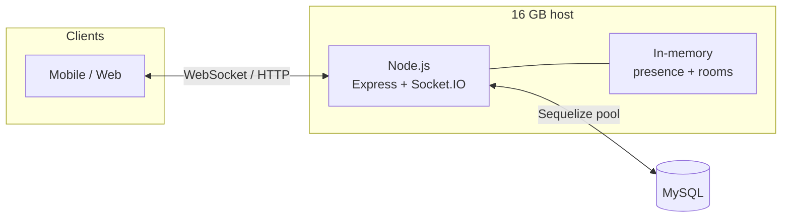

# Post-optimization capacity — 16 GB RAM (architecture & planning)

**Companion to:** [DAU_CAPACITY_16GB_REPORT.md](./DAU_CAPACITY_16GB_REPORT.md) (definitions of **DAU**, **PCU**, **peak overlap \(p\)**, RAM model, and DB write bands — still authoritative for first-principles math).

**Purpose:** Record **what changed in code**, **why the architecture scales better on the same RAM**, and **how to interpret capacity after optimization** without implying magic multipliers on hard limits (heap bytes per socket, MySQL insert ceiling). **Future architecture and modules:** see **§8**.

---

## 1. Executive summary (after optimization)

| Dimension | Before (baseline in codebase) | After (current optimized path) |
|-----------|-------------------------------|----------------------------------|
| **Primary scale risk on connect/disconnect** | Global `user:presence` → **every** socket notified (**O(N)** per churn event). | **Scoped** presence (default): `user:{id}` + each `group:{id}` only — fan-out scales with **interest set**, not total **N**. |
| **DB connection concurrency** | Implicit Sequelize pool (often **~5** connections). | Explicit pool (**default `DB_POOL_MAX=30`**, tunable) — more **parallel** queries/writes **if** MySQL and `max_connections` allow. |
| **CPU per WebSocket message (typical)** | Default Socket.IO **per-message deflate** enabled. | **Deflate off by default** (configurable) — less CPU at high message rates; may use more bandwidth. |
| **Connect path DB load** | `listMyGroups` hit MySQL on **every** socket connect. | **~45 s TTL cache** per user with invalidation on membership mutations — fewer queries under **reconnect storms**. |
| **Wire shape for chat events** | Full Sequelize model instances emitted. | **`get({ plain: true })`** — plain JSON over the socket. |

**What did *not* fundamentally change:**  
**Bytes per concurrent socket** and **heap budget** still cap **PCU** in the same order of magnitude as the original report (**~5k–15k** engineering band on a 16 GB–class host, until you load-test your shape). Optimizations mainly improve **CPU**, **egress**, **event-loop stability under churn**, and **ability to use the DB tier** — so the system can stay healthy **at similar or somewhat higher PCU** when traffic is **churn-heavy** or **write-parallel**, and avoid falling over **before** RAM.

**DAU** is still **not** a direct function of RAM: **DAU ≈ PCU ÷ \(p\)** at peak (see companion doc §7). After optimization, **\(p\)** and **messages/day** still determine whether you are safe; the **bottleneck shifts** away from “global presence melted the CPU.”

---

## 2. Before vs after: DAU, concurrent users (PCU), and what swings the most

Use this table when explaining **same 16 GB RAM** — what is **almost the same**, what **can change a lot**, and what **does not** move.

### 2.1 DAU and peak concurrent users (PCU)

| Parameter | Before (legacy behavior) | After (current defaults) | Changes a lot? |
|-----------|---------------------------|---------------------------|----------------|
| **DAU (formula)** | **DAU ≈ PCU ÷ p** | **Same identity** | **No** — the math is identical. Code does not assign a new “max DAU.” |
| **DAU (operationally)** | If churn/presence melted CPU **below** your target PCU, you effectively could not **use** the overlap math you thought you had. | Same **p** and PCU plan, but you are **less likely** to be CPU-capped **before** RAM — so the **same nominal PCU** is more often **reachable** in churny apps. | **Indirect** — “supportable product DAU” can **feel** higher only because you no longer die on presence **before** hitting your PCU budget. |
| **PCU ceiling (RAM / heap)** | Plan **~5k–15k** concurrent sockets (companion doc §5.3). | **Same planning band** | **No** — not a large jump in max simultaneous connections from RAM alone. |
| **Sustainable PCU under high reconnect rate** | Global presence → **~N** `user:presence` deliveries per connect/disconnect → CPU/egress often the limiter **below** RAM. | Scoped presence → deliveries scale with **rooms / group membership**, not **N**. | **Yes** — often **orders-of-magnitude** fewer presence packets when **N** is large; you may hold **steady PCU** where the old stack could not. |

**Numeric illustration (presence only, one user connects):**  
Let **N** = total open sockets on the server, **G** = that user’s group count (small), **M_g** = online members in group **g** (varies). Legacy ≈ **N** deliveries per `user:presence` connect event; scoped ≈ **(tabs for user) + Σ_g M_g** (each socket in relevant rooms receives at most the group copy), which is **≪ N** when **N** is tens of thousands.

### 2.2 Other parameters that often change drastically

| Parameter | Before | After | Typical magnitude |
|-----------|--------|-------|-------------------|
| **Sequelize `pool.max` (app default)** | Implicit, often **~5** | **`DB_POOL_MAX` default 30** | **Up to ~6×** more in-flight DB connections **from the app** (still ≤ MySQL `max_connections`). |
| **`listMyGroups` DB queries** | **1 query per socket connect** | **≤ 1 per user per ~45 s** (TTL) + invalidation on membership change | Under reconnect storms: **large reduction** in identical reads. |
| **`user:presence` network / CPU work per churn** | **Θ(N)** per event (global emit) | **Θ(interest)** — scoped rooms | **Very large** gap when **N** is big (report often cites **3–10×+** as realistic for presence **work**, not for PCU ceiling). |
| **Socket.IO `perMessageDeflate` (default)** | On (more CPU, less bandwidth) | **Off by default** | **CPU per chat message** can drop **materially** at high msg rates (measure; depends on payload). |
| **Chat event payload shape** | Sequelize model instance serialized | Plain row (`get({ plain: true })`) | **Smaller / cheaper** serialization; modest to moderate win at high emit rates. |
| **Sustained `msg/s` (MySQL-bound)** | Often **app-pool-limited** near **~5** parallel writes | Pool can **feed** DB up to companion bands **~50–300 msg/s** **if** MySQL allows | **Drastic** if you were queue-bound at 5; **flat** if MySQL was already the bottleneck. |

### 2.3 What to put in an executive one-liner

- **“More scalable?”** **Yes** on **churn**, **presence fan-out**, **reconnect DB noise**, and **pool-induced queueing**.  
- **“2× max concurrent users on 16 GB?”** **Not** as a default expectation — **PCU** band stays **~5k–15k** until measured.  
- **“Higher DAU?”** Only through the **same** relationship **DAU ≈ PCU ÷ p**, plus not failing early on **non-RAM** limits — not a new constant like “DAU doubled.”

For a **tiered roadmap** (principles, suggested `src/` modules, infra, and a **comparison vs now**), see **§8**.

---

## 3. Architecture: what “optimization” means here

### 3.1 Design principle (same RAM)

On a **single Node** process with an **in-memory** Socket.IO adapter:

1. **Do not multiply cost with total users when only a subset cares** — replace global broadcasts with **room-scoped** emits where the product allows it.
2. **Do not under-provision the DB pool** relative to MySQL — parallelism was artificially capped at ~5; raising the pool increases **sustained write/read concurrency** up to what the **database** tolerates (not unlimited).
3. **Buy CPU headroom with algorithm and transport choices** (scoped presence, optional deflate off, plain payloads) so **RAM-limited PCU** is reachable in practice under real churn.

### 3.2 Topology (unchanged)

Runtime is still: **one Node** (Express + Socket.IO) ↔ **MySQL** via Sequelize. Horizontal **cluster** of multiple Node workers for Socket.IO **without** Redis + sticky sessions is **not** a safe capacity multiplier for this stack (see companion doc §9–10).

**Semantic change (default):** `user:presence` is no longer universe-wide. Users who **only** direct-message and **share no groups** may not see each other’s presence over the socket unless you set **`USER_PRESENCE_BROADCAST=global`** or add a product-specific channel (e.g. contacts room).

---

## 4. Change log (repository)

| Area | File(s) | Change |
|------|---------|--------|
| Scoped user presence | `src/socket/emit-user-presence.ts` (new), `src/socket/register-events.ts` | `emitUserPresence(...)` replaces `socketServer.emit("user:presence", ...)` for connect/disconnect when mode is **scoped** (default). |
| Presence mode flag | `src/config/env.ts` | `USER_PRESENCE_BROADCAST` → `scoped` (default) or `global`. |
| Sequelize pool | `src/config/database.ts`, `src/config/env.ts` | `pool.max`, `pool.min`, `pool.acquire`, `pool.idle` from env; defaults tuned for higher concurrency than Sequelize’s implicit default. |
| Socket.IO server options | `src/server.ts`, `src/config/env.ts` | `perMessageDeflate`, `pingInterval`, `pingTimeout`, `maxHttpBufferSize` driven by env. |
| Group list cache | `src/services/group.service.ts` | TTL cache for `listMyGroups`; `invalidateListMyGroupsCacheForUsers` on create/add/remove/change-admin. |
| Chat payloads | `src/socket/register-events.ts` | Emit plain row for `group:message` and `direct:message`. |

---

## 5. Environment variables (quick reference)

| Variable | Role | Default / notes |
|----------|------|------------------|
| `USER_PRESENCE_BROADCAST` | `scoped` vs `global` user presence | Default **scoped**; use **global** for legacy “everyone sees everyone” semantics. |
| `DB_POOL_MAX` | Sequelize pool max | **30** (must be ≤ MySQL `max_connections` budget for this app). |
| `DB_POOL_MIN`, `DB_POOL_ACQUIRE_MS`, `DB_POOL_IDLE_MS` | Pool tuning | See `src/config/env.ts`. |
| `SOCKET_IO_PER_MESSAGE_DEFLATE` | Set to `true` to re-enable deflate | Default off (**false** unless `true`). |
| `SOCKET_IO_PING_INTERVAL_MS`, `SOCKET_IO_PING_TIMEOUT_MS`, `SOCKET_IO_MAX_HTTP_BUFFER` | Transport tuning | See `src/config/env.ts`. |

Node heap for the process (e.g. `NODE_OPTIONS=--max-old-space-size=12288`) remains a **deployment** choice; see companion doc §4–5.

---

## 6. Capacity after optimization — 16 GB RAM (planning bands)

All numbers are **planning bands**, not SLAs. **Load test** on your VM, DB tier, and traffic mix.

### 6.1 Peak concurrent users (PCU) — RAM / heap

The **first-order RAM ceiling** for open sockets is **unchanged** in formula form (companion doc §5): it still depends on heap **H**, headroom **f**, and bytes per socket **b**.

**Practical effect of optimization:** Under **high connect/disconnect churn**, the old global presence path could drive **CPU and egress** into saturation **below** the RAM-derived PCU. After optimization, you are more likely to **actually reach** the RAM-limited band before the CPU gives out — so **operationally sustainable PCU** can move **upward** in churny workloads, but the **~5k–15k** single-instance engineering band from the companion doc remains the right **starting point** until measured.

| Stance | PCU (single 16 GB–class instance) | Comment after optimization |
|--------|-----------------------------------|----------------------------|
| Conservative | **~5,000** | Safer if MySQL is small, co-located, or presence mode is **global**. |
| Typical | **~8,000–12,000** | Aligns with companion doc; **scoped** presence + pool + deflate default helps **hold** this under churn. |
| Optimistic | **~12,000–18,000+** | Requires tuned heap, external DB, measured event-loop and GC; not guaranteed by code alone. |

### 6.2 Presence / control-plane “traffic” (not DAU)

For **one** connect or disconnect, legacy global presence sent **on the order of N** `user:presence` deliveries (every socket). Scoped mode sends to:

- **`user:{user_id}`** (typically a small number of tabs/devices), plus  
- **`group:{id}`** for each group the user belongs to (each delivery goes to **members in that room**, not the whole server).

So **control-plane multiplier vs N** improves from **linear in N** to **roughly linear in (devices + sum over groups of online members in that group)** — often **orders of magnitude** smaller than **N** for large deployments. That is where a **3–10×** (or more) improvement in **presence-related work** is realistic **when N is large** and groups are modestly sized.

### 6.3 Message writes (throughput) — not RAM-limited

Companion doc §6 still applies: sustained **msg/s** is bounded by **MySQL** and app design (one insert per message today).

**Pool change:** Moving from an implicit **~5** to **up to 30** concurrent Sequelize connections removes an **artificial** queue at the app. **Planning bands** from the companion doc remain reasonable until you measure:

| Stance | Sustained writes (order of magnitude) |
|--------|----------------------------------------|
| Conservative | **~50 msg/s** |
| Typical | **~100–150 msg/s** |
| Optimistic | **~200–300 msg/s** |

If the DB was not the limiter, you may see **higher burst** acceptance; if MySQL is the limiter, **pool alone** will not create unlimited msg/s.

### 6.4 DAU (unchanged identity)

\[
\textbf{DAU} \approx \frac{\textbf{PCU}}{\textbf{p}}
\]

**Example (same as companion logic):** If you **plan** for **PCU = 10,000** and **p = 5%** at peak, then **DAU ≈ 200,000** from overlap math alone — **optimization does not change this formula**; it makes **hitting 10k PCU** more plausible when churn used to cap you earlier.

| PCU (planning) | Peak overlap \(p\) | Implied DAU (order of magnitude) |
|----------------|--------------------|-----------------------------------|
| 10,000 | 10% | ~100,000 |
| 10,000 | 5% | ~200,000 |
| 10,000 | 2% | ~500,000 |
| 5,000 | 5% | ~100,000 |

You must still cross-check **messages per day** vs §6.3 (companion §6).

---

## 7. What to do next (measurement)

1. Run load tests: target **PCU**, **connect/disconnect rate**, and **msg/s** separately.  
2. Watch **event loop lag**, **CPU**, **RSS**, **MySQL threads_running** and **latency**.  
3. Set **`DB_POOL_MAX`** from DB capacity (per app instance).  
4. Confirm clients accept **scoped** presence; otherwise set **`USER_PRESENCE_BROADCAST=global`** and expect lower safe PCU under churn.

---

## 8. Further optimization (architecture, principles, optional modules)

This section is a **roadmap**: how to push toward a **larger audience on the same 16 GB RAM** using **computer science / systems** ideas, **new parameters**, and **optional custom modules** under `src/`. It extends the comparison in **§2** — nothing here replaces **load testing** or **MySQL physics**.

### 8.1 Principles (same RAM, bigger audience)

| Principle | What it means for this codebase | Typical lever |
|-----------|----------------------------------|----------------|
| **Move work off the hot path** | Socket handler should **ack fast**; persistence can **lag slightly** behind delivery if the product accepts at-most-once vs exactly-once tradeoffs. | Outbox queue + worker; batch inserts |
| **Bound everything** | Unbounded in-memory queues **grow RAM** on the same box — use **max length**, **drop/shed**, or **spill to disk/Redis**. | Admission control, rate limits |
| **Separate concerns** | HTTP REST, WebSocket fan-out, and **DB writes** scale differently; coupling them in one loop **couples tail latency**. | Split processes or isolate write path |
| **Locality of data** | Reads (history) dominate bytes; writes (new messages) dominate contention. | Read replicas; cache recent threads |
| **Backpressure** | When DB is slow, **do not** accept infinite `chat:*:send` work — clients queue locally or get **429/retry**. | Semaphore on in-flight writes |
| **Observability** | You cannot optimize what you do not measure. | Metrics for PCU, msg/s, pool wait, event-loop lag |

**Same 16 GB:** You mainly win by **doing less per user**, **doing work asynchronously**, and **avoiding duplicate work** — not by infinite vertical scale on one heap.

### 8.2 Tier A — parameters & code shape (no new infrastructure)

Still within **one Node**, `src/` + env only:

| Idea | Parameter / location | Effect on audience @ 16 GB |
|------|----------------------|-----------------------------|
| **Heap cap** | `NODE_OPTIONS=--max-old-space-size` | Higher **PCU** ceiling if GC stable; wrong value **OOM** — tune with RSS monitoring. |
| **Pool vs DB** | `DB_POOL_MAX`, MySQL `max_connections` | Match pool to **DB**; oversubscribing **hurts** everyone. |
| **Socket buffer caps** | `SOCKET_IO_MAX_HTTP_BUFFER` | Prevents **one** giant payload from pinning RAM. |
| **HTTP body limits** | `express.json({ limit: '…' })` in `src/app.ts` | Same idea for REST abuse. |
| **Sequelize lean queries** | `attributes`, `raw`, no N+1 on hot routes | **Lower CPU + RAM** per API call → more headroom for sockets. |
| **Indexes & query plans** | Models / migrations | Cheaper reads → more capacity for same RAM. |
| **Admission control** | New env: `MAX_PCU` or dynamic reject on high RSS | **Hard cap** connections — serves **predictable** audience vs undefined crash. |

### 8.3 Tier B — custom modules (recommended `src/` layout)

Introduce **small, testable** modules rather than growing `register-events.ts` forever:

| Module (suggested path) | Responsibility | CS / design pattern |
|-------------------------|----------------|---------------------|
| `src/config/limits.ts` | Centralize numeric caps (payload KB, max groups per emit batch, max in-flight writes). | **Single source of truth** |
| `src/infra/rate-limit.ts` | Token bucket / fixed window per `user_id` or IP for HTTP + optional socket events. | **Resource protection** |
| `src/infra/backpressure.ts` | Semaphore: max concurrent `ChatMessage.create` in flight; queue or reject when full. | **Backpressure** |
| `src/socket/message-dispatcher.ts` | Thin layer: validate → persist → emit (order explicit). | **Separation of concerns** |
| `src/workers/outbox-worker.ts` (optional process) | Drain `outbox` table: batch `bulkCreate`, retry with idempotency keys. | **Producer–consumer**, **write batching** |
| `src/cache/redis-groups.ts` (optional) | Shared cache for `listMyGroups` across **future** multi-node — only if Redis exists. | **Distributed cache** |

**Batch writes (high impact on msg/s, not PCU):** insert into a **staging/outbox** row in the same transaction as an id, **emit** to room from memory, worker **flushes** to `chat_message` in batches — trades **complexity** and **durability semantics** for **higher sustained inserts** on the same DB dollar.

### 8.4 Tier C — architecture changes (same 16 GB *per role*, often split hosts)

These change **topology**, not just `src/`:

| Change | Why | Audience effect |
|--------|-----|-------------------|
| **Redis + `@socket.io/redis-adapter`** | Multi-node Socket.IO with shared room semantics | **Horizontal PCU**; each node stays within **~5k–15k** class — **total** audience scales with **node count** (each node still ~16 GB class or smaller). |
| **Redis / Valkey for presence + group cache** | Process-local `Map` does not survive multi-node | Correct presence across nodes; can **reduce** per-process RAM if presence moves out (trade: **network** to Redis). |
| **Separate “read” API from “write/socket” tier** | Reads (history, search) **chew** DB and JSON CPU; isolates **write + fan-out** path | Same **16 GB** on socket box holds **more PCU** if heavy reads move to another service or replica. |
| **Read replica for `findAll` history** | **CQRS-lite**: writes to primary, reads from replica | Less contention on primary → **higher msg/s** and calmer socket tier. |
| **CDN / edge for assets** | Not chat, but frees **CPU + bandwidth** on origin | More room for WebSockets on the same VM. |

**Note:** Tier C often means **multiple** 16 GB (or smaller) boxes — “larger audience” is **fleet-wide**. One **single** 16 GB JVM/Node heap still obeys the same **~5k–15k PCU** class unless you prove otherwise.

### 8.5 Comparison — current post-change vs future tiers (qualitative)

| Dimension | **Now** (after §1–6 optimizations) | **+ Tier A** (tighter limits, heap tuning, lean SQL) | **+ Tier B** (rate limit, backpressure, outbox/batch) | **+ Tier C** (Redis adapter, split read/write, replica) |
|-----------|-----------------------------------|------------------------------------------------------|--------------------------------------------------------|---------------------------------------------------------|
| **PCU / 16 GB instance** | **~5k–15k** band; churn-friendly | Slightly **higher stable** PCU if CPU/GC improved | Stable under **spikes**; may **reject** overload cleanly | **Per-node** similar; **total** PCU **sum of nodes** |
| **Presence correctness** | In-process, single node | Same | Same | **Shared** via Redis / DB |
| **Sustained msg/s** | MySQL + pool **~50–300** planning | Same DB; fewer wasted queries | **Higher** if batch/outbox + idempotency acceptable | **Higher** with replica offload + scale-out writers |
| **Complexity** | Low | Low | **Medium** (queues, retries, semantics) | **High** (ops, consistency, sticky LB) |
| **New dependencies** | Current stack | None | In-process or MySQL-only possible; optional Redis | **Redis**, LB stickiness, often **≥2 nodes** |

### 8.6 Parameters to introduce later (examples)

| Env / knob | Purpose |
|------------|---------|
| `MAX_SOCKET_CONNECTIONS` | Reject new WS when over cap — **protects** RAM. |
| `MAX_IN_FLIGHT_DB_WRITES` | Backpressure for `ChatMessage.create`. |
| `GROUP_LIST_CACHE_TTL_MS` | Tune `listMyGroups` freshness vs DB load (today fixed in code). |
| `OUTBOX_FLUSH_MS` / `OUTBOX_BATCH_SIZE` | If outbox worker added. |
| `REDIS_URL` | If Socket.IO adapter + shared presence added. |

Implement these only with **metrics** and **tests**; defaults should stay safe.

---

## 9. Document control

| Field | Value |
|-------|-------|
| Document type | Post-optimization capacity, changelog, before/after comparison (**§2**), further roadmap (**§8**) |
| Applies to | Implemented: presence scoping, pool tuning, Socket.IO env tuning, `listMyGroups` cache. **§8** includes **not yet implemented** architecture options. |
| Validation | **Load testing required** before contractual SLAs |

---

*Engineering aid only. Final DAU/PCU/msg/s limits depend on production measurement.*
