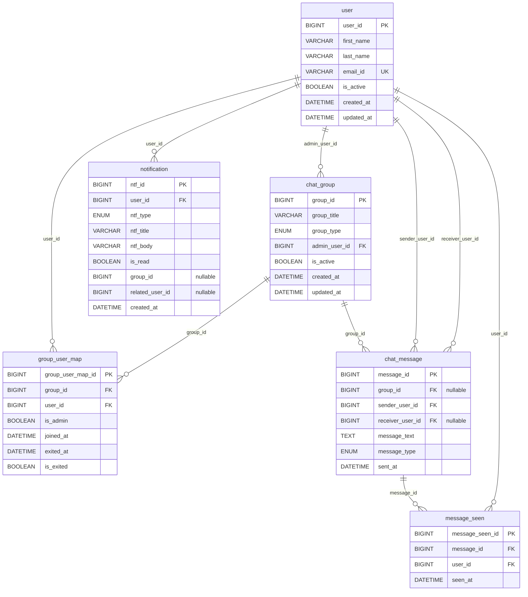
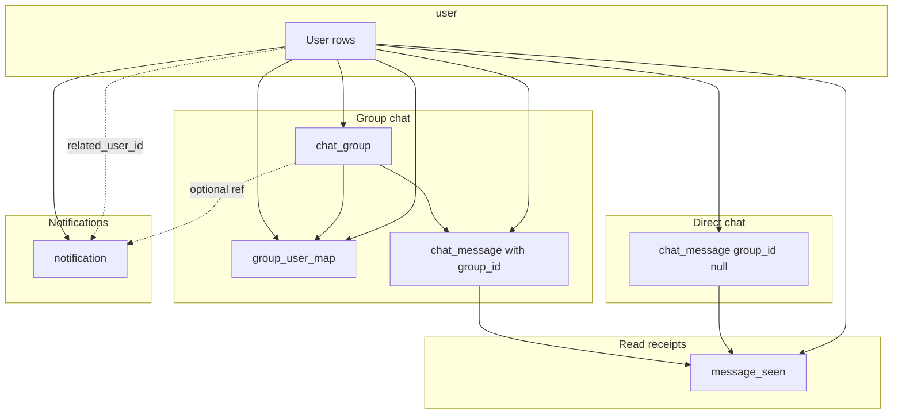

# Database schema — diagrams and reference

This document describes the **MySQL tables** and **logical relationships** implied by the Sequelize models in `src/models/` and the associations declared in `src/models/index.ts`. Use it alongside the [LLD](../LLD/LLD.md) for API behavior.

**Source of truth:** `src/models/*.model.ts` and `src/models/index.ts`.

---

## 1. Entity overview

| Sequelize model | MySQL table | Purpose |
|-----------------|-------------|---------|
| `User` | `user` | End-user profile and identity for chat. |
| `ChatGroup` | `chat_group` | A named chat group; stores current **admin** user id. |
| `GroupUserMap` | `group_user_map` | Membership (and soft-exit) of users in groups; per-member **admin** flag. |
| `ChatMessage` | `chat_message` | **Group** messages (`group_id` set) or **direct** messages (`group_id` null, `receiver_user_id` set). |
| `MessageSeen` | `message_seen` | Read receipt: which user saw which message (unique per pair). |
| `Notification` | `notification` | In-app notification row per recipient user. |

All models use **`timestamps: false`** with explicit `created_at` / `updated_at` or `created_at` / `sent_at` / `seen_at` columns where defined.

---

## 2. ER diagram (logical / relational)

Mermaid **`erDiagram`** reflects **foreign key columns** on tables and cardinality. MySQL may or may not have physical `FOREIGN KEY` constraints depending on migration history; Sequelize **`belongsTo`** documents the intended joins.

**How to read `chat_message`**

- **Group chat row:** `group_id` **not null**; `receiver_user_id` typically **null**.
- **Direct message row:** `group_id` **null**; `receiver_user_id` **not null** (the other party).

---

## 3. Domain diagram (groups vs DMs vs notifications)

High-level picture of how entities cooperate in the product (not all FKs are drawn on `notification` optional refs).

 
---

## 4. Sequelize associations (`src/models/index.ts`)

Only **`belongsTo`** is declared (child → parent). Inverse associations (`hasMany`) are not registered in this file but can be inferred for queries.

| Child model | Association | Foreign key | Alias |
|-------------|-------------|-------------|--------|
| `ChatGroup` | `belongsTo` `User` | `admin_user_id` | `admin` |
| `GroupUserMap` | `belongsTo` `ChatGroup` | `group_id` | — |
| `GroupUserMap` | `belongsTo` `User` | `user_id` | — |
| `ChatMessage` | `belongsTo` `ChatGroup` | `group_id` | — |
| `ChatMessage` | `belongsTo` `User` | `sender_user_id` | `sender` |
| `ChatMessage` | `belongsTo` `User` | `receiver_user_id` | `receiver` |
| `MessageSeen` | `belongsTo` `ChatMessage` | `message_id` | — |
| `MessageSeen` | `belongsTo` `User` | `user_id` | — |
| `Notification` | `belongsTo` `User` | `user_id` | — |

**Note:** `Notification.group_id` and `Notification.related_user_id` are **columns only**; there is **no** `belongsTo(ChatGroup)` or `belongsTo(User, { as: 'related' })` in `index.ts`. Application code treats them as optional references.

---

## 5. Table reference (columns, types, indexes)

Types below match Sequelize **`DataTypes`** (MySQL physical types follow Sequelize mapping: e.g. `BIGINT.UNSIGNED`, `STRING(n)`, `TEXT`, `BOOLEAN`, `ENUM`, `DATE`).

### 5.1 `user`

| Column | Type | Constraints / notes |
|--------|------|------------------------|
| `user_id` | BIGINT UNSIGNED | PK, auto-increment |
| `first_name` | VARCHAR(100) | NOT NULL |
| `last_name` | VARCHAR(100) | NOT NULL |
| `email_id` | VARCHAR(200) | NOT NULL, unique `uk_user_email_id` |
| `is_active` | BOOLEAN | NOT NULL, default `true` |
| `created_at` | DATE | NOT NULL, default NOW |
| `updated_at` | DATE | NOT NULL, default NOW |

**Indexes:** `idx_user_email_id` (`email_id`), `idx_user_is_active` (`is_active`).

---

### 5.2 `chat_group`

| Column | Type | Constraints / notes |
|--------|------|------------------------|
| `group_id` | BIGINT UNSIGNED | PK, auto-increment |
| `group_title` | VARCHAR(120) | NOT NULL |
| `group_type` | ENUM(`group`) | NOT NULL, default `group` |
| `admin_user_id` | BIGINT UNSIGNED | NOT NULL → logical FK to `user.user_id` |
| `is_active` | BOOLEAN | NOT NULL, default `true` |
| `created_at` | DATE | NOT NULL, default NOW |
| `updated_at` | DATE | NOT NULL, default NOW |

**Indexes:** `idx_chat_group_admin_user_id` (`admin_user_id`).

---

### 5.3 `group_user_map`

| Column | Type | Constraints / notes |
|--------|------|------------------------|
| `group_user_map_id` | BIGINT UNSIGNED | PK, auto-increment |
| `group_id` | BIGINT UNSIGNED | NOT NULL → `chat_group.group_id` |
| `user_id` | BIGINT UNSIGNED | NOT NULL → `user.user_id` |
| `is_admin` | BOOLEAN | NOT NULL, default `false` |
| `joined_at` | DATE | NOT NULL, default NOW |
| `exited_at` | DATE | NULL |
| `is_exited` | BOOLEAN | NOT NULL, default `false` |

**Indexes:** `idx_group_user_map_group_id`, `idx_group_user_map_user_id`, **unique** `uk_group_user_map_group_user` (`group_id`, `user_id`).

**Semantics:** One row per user–group pair; leaving a group sets `is_exited = true` and `exited_at` (soft delete). Re-adding a member creates a **new** row only if the unique key allows it — current service logic adds only **missing** active memberships; duplicate keys would error if the same user were re-added without clearing the unique constraint (implementation detail for migrations).

---

### 5.4 `chat_message`

| Column | Type | Constraints / notes |
|--------|------|------------------------|
| `message_id` | BIGINT UNSIGNED | PK, auto-increment |
| `group_id` | BIGINT UNSIGNED | **NULL** allowed — **null = direct message** |
| `sender_user_id` | BIGINT UNSIGNED | NOT NULL → `user.user_id` |
| `receiver_user_id` | BIGINT UNSIGNED | **NULL** allowed — set for DMs |
| `message_text` | TEXT | NOT NULL |
| `message_type` | ENUM(`text`) | NOT NULL, default `text` |
| `sent_at` | DATE | NOT NULL, default NOW |

**Indexes:** `group_id`, `sender_user_id`, `receiver_user_id`, `sent_at`.

---

### 5.5 `message_seen`

| Column | Type | Constraints / notes |
|--------|------|------------------------|
| `message_seen_id` | BIGINT UNSIGNED | PK, auto-increment |
| `message_id` | BIGINT UNSIGNED | NOT NULL → `chat_message.message_id` |
| `user_id` | BIGINT UNSIGNED | NOT NULL → `user.user_id` |
| `seen_at` | DATE | NOT NULL, default NOW |

**Indexes:** **unique** `uk_message_seen_message_user` (`message_id`, `user_id`).

---

### 5.6 `notification`

| Column | Type | Constraints / notes |
|--------|------|------------------------|
| `ntf_id` | BIGINT UNSIGNED | PK, auto-increment |
| `user_id` | BIGINT UNSIGNED | NOT NULL — recipient → `user.user_id` |
| `ntf_type` | ENUM(`group`, `direct`, `system`) | NOT NULL, default `system` |
| `ntf_title` | VARCHAR(150) | NOT NULL |
| `ntf_body` | VARCHAR(600) | NOT NULL |
| `is_read` | BOOLEAN | NOT NULL, default `false` |
| `group_id` | BIGINT UNSIGNED | NULL — context for `group` type |
| `related_user_id` | BIGINT UNSIGNED | NULL — e.g. DM sender for `direct` type |
| `created_at` | DATE | NOT NULL, default NOW |

**Indexes:** `idx_ntf_user_id`, `idx_ntf_is_read`.

--- 